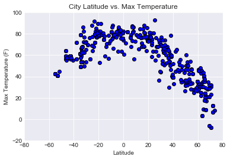
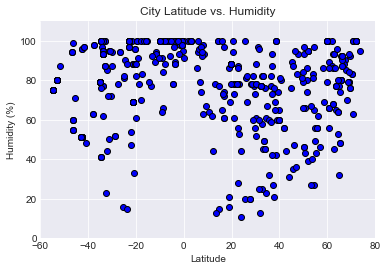
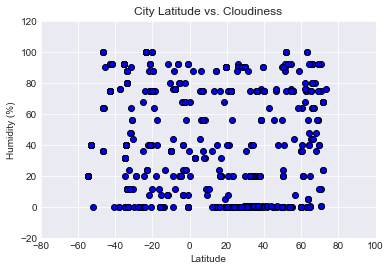
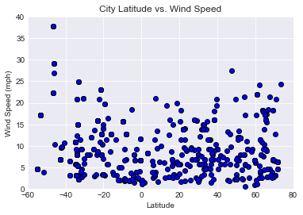

```python
#Observable Trend 1 Temperature decreases as you move away from the equator, mostly in the Northern Hemisphere.
#Observable Trend 2 Humidity is high at the equator but is more random as you move away from the equator.
#Observable Trend 3 There does not appear to be an observable trend in wind speed and cloudiness as you move away from the equator. However, the highest wind speeds are observed in the Southern Hemisphere
```


```python
import json
import requests 
import random
import numpy as np
from pprint import pprint
from config import api_key

import matplotlib.pyplot as plt
import pandas as pd

import openweathermapy.core as owm
from citipy import citipy
```


```python
iterator = 1
total_cities = 600

city_name_list = []
country_code_list = []

while iterator <= total_cities:

    lat = random.uniform(-75, 75)
    lon = random.uniform(-180, 180)
    city = citipy.nearest_city(lat, lon)
    country_code = city.country_code
    name = city.city_name
    city_name_list.append(name)
    country_code_list.append(country_code)
    
    iterator += 1
    
```


```python
city_dict = {"City": city_name_list,
            "Country": country_code_list}
city_pd = pd.DataFrame(city_dict)
city_pd["Latitude"] = ""
city_pd["Longitude"] = ""
city_pd["Temperature"] = ""
city_pd["Humidity"] = ""
city_pd["Wind Speed"] = ""
city_pd["Cloudiness"] = ""
city_pd.head()
```


<div>
<style scoped>
    .dataframe tbody tr th:only-of-type {
        vertical-align: middle;
    }

    .dataframe tbody tr th {
        vertical-align: top;
    }

    .dataframe thead th {
        text-align: right;
    }
</style>
<table border="1" class="dataframe">
  <thead>
    <tr style="text-align: right;">
      <th></th>
      <th>City</th>
      <th>Country</th>
      <th>Latitude</th>
      <th>Longitude</th>
      <th>Temperature</th>
      <th>Humidity</th>
      <th>Wind Speed</th>
      <th>Cloudiness</th>
    </tr>
  </thead>
  <tbody>
    <tr>
      <th>0</th>
      <td>lata</td>
      <td>sb</td>
      <td></td>
      <td></td>
      <td></td>
      <td></td>
      <td></td>
      <td></td>
    </tr>
    <tr>
      <th>1</th>
      <td>saint george</td>
      <td>bm</td>
      <td></td>
      <td></td>
      <td></td>
      <td></td>
      <td></td>
      <td></td>
    </tr>
    <tr>
      <th>2</th>
      <td>puerto leguizamo</td>
      <td>co</td>
      <td></td>
      <td></td>
      <td></td>
      <td></td>
      <td></td>
      <td></td>
    </tr>
    <tr>
      <th>3</th>
      <td>poum</td>
      <td>nc</td>
      <td></td>
      <td></td>
      <td></td>
      <td></td>
      <td></td>
      <td></td>
    </tr>
    <tr>
      <th>4</th>
      <td>nome</td>
      <td>us</td>
      <td></td>
      <td></td>
      <td></td>
      <td></td>
      <td></td>
      <td></td>
    </tr>
  </tbody>
</table>
</div>


```python
url = "http://api.openweathermap.org/data/2.5/weather?"
units = "imperial"
query_url = f"{url}appid={api_key}&units={units}&q="

count = 1

# Loop through cities_pd, lat/long search for each city
for index, row in city_pd.iterrows():

    city = row['City']
    country = row['Country']
    
    weather_response = requests.get(query_url + city + "," + country)
    weather_json = weather_response.json()
    
    print(f"Requesting current weather data for city #{count} {city}, {country}  ")
    print("URL: "+ weather_response.url)
    print()
    
    try:
        city_pd.at[index, "Latitude"] = weather_json['coord']['lat']
        city_pd.at[index, "Longitude"] = weather_json['coord']['lon']
        city_pd.at[index, "Temperature"] = weather_json['main']['temp']
        city_pd.at[index, "Humidity"] = weather_json['main']['humidity']
        city_pd.at[index, "Wind Speed"] = weather_json['wind']['speed']
        city_pd.at[index, "Cloudiness"] = weather_json['clouds']['all']
    
    except (KeyError):
        print("Missing field/result... skipping.")
        print()
        
    count += 1
    
```

    Requesting current weather data for city #1 lata, sb  
    URL: http://api.openweathermap.org/data/2.5/weather?appid=16ade95a2911a638d683ffd2a5dee5c9&units=imperial&q=lata,sb
    
    Missing field/result... skipping.
    
    Requesting current weather data for city #2 saint george, bm  
    URL: http://api.openweathermap.org/data/2.5/weather?appid=16ade95a2911a638d683ffd2a5dee5c9&units=imperial&q=saint%20george,bm
    
    Requesting current weather data for city #3 puerto leguizamo, co  
    URL: http://api.openweathermap.org/data/2.5/weather?appid=16ade95a2911a638d683ffd2a5dee5c9&units=imperial&q=puerto%20leguizamo,co
    
    Requesting current weather data for city #4 poum, nc  
    URL: http://api.openweathermap.org/data/2.5/weather?appid=16ade95a2911a638d683ffd2a5dee5c9&units=imperial&q=poum,nc
    
    Requesting current weather data for city #5 nome, us  
    URL: http://api.openweathermap.org/data/2.5/weather?appid=16ade95a2911a638d683ffd2a5dee5c9&units=imperial&q=nome,us
    
    Requesting current weather data for city #6 kavieng, pg  
    URL: http://api.openweathermap.org/data/2.5/weather?appid=16ade95a2911a638d683ffd2a5dee5c9&units=imperial&q=kavieng,pg
    
    Requesting current weather data for city #7 bluff, nz  
    URL: http://api.openweathermap.org/data/2.5/weather?appid=16ade95a2911a638d683ffd2a5dee5c9&units=imperial&q=bluff,nz
    
    Requesting current weather data for city #8 mananjary, mg  
    URL: http://api.openweathermap.org/data/2.5/weather?appid=16ade95a2911a638d683ffd2a5dee5c9&units=imperial&q=mananjary,mg
    
    Requesting current weather data for city #9 praya, id  
    URL: http://api.openweathermap.org/data/2.5/weather?appid=16ade95a2911a638d683ffd2a5dee5c9&units=imperial&q=praya,id
    
    Requesting current weather data for city #10 saint-philippe, re  
    URL: http://api.openweathermap.org/data/2.5/weather?appid=16ade95a2911a638d683ffd2a5dee5c9&units=imperial&q=saint-philippe,re
    
    Requesting current weather data for city #11 clyde river, ca  
    URL: http://api.openweathermap.org/data/2.5/weather?appid=16ade95a2911a638d683ffd2a5dee5c9&units=imperial&q=clyde%20river,ca
    
    Requesting current weather data for city #12 matara, lk  
    URL: http://api.openweathermap.org/data/2.5/weather?appid=16ade95a2911a638d683ffd2a5dee5c9&units=imperial&q=matara,lk
    
    Requesting current weather data for city #13 abu kamal, sy  
    URL: http://api.openweathermap.org/data/2.5/weather?appid=16ade95a2911a638d683ffd2a5dee5c9&units=imperial&q=abu%20kamal,sy
    
    Requesting current weather data for city #14 new norfolk, au  
    URL: http://api.openweathermap.org/data/2.5/weather?appid=16ade95a2911a638d683ffd2a5dee5c9&units=imperial&q=new%20norfolk,au
    
    Requesting current weather data for city #15 asau, tv  
    URL: http://api.openweathermap.org/data/2.5/weather?appid=16ade95a2911a638d683ffd2a5dee5c9&units=imperial&q=asau,tv
    
    Missing field/result... skipping.
    
    Requesting current weather data for city #16 namatanai, pg  
    URL: http://api.openweathermap.org/data/2.5/weather?appid=16ade95a2911a638d683ffd2a5dee5c9&units=imperial&q=namatanai,pg
    
    Requesting current weather data for city #17 cedral, mx  
    URL: http://api.openweathermap.org/data/2.5/weather?appid=16ade95a2911a638d683ffd2a5dee5c9&units=imperial&q=cedral,mx
    
    Requesting current weather data for city #18 mount gambier, au  
    URL: http://api.openweathermap.org/data/2.5/weather?appid=16ade95a2911a638d683ffd2a5dee5c9&units=imperial&q=mount%20gambier,au
    
    Requesting current weather data for city #19 marcona, pe  
    URL: http://api.openweathermap.org/data/2.5/weather?appid=16ade95a2911a638d683ffd2a5dee5c9&units=imperial&q=marcona,pe
    
    Missing field/result... skipping.
    
    Requesting current weather data for city #20 rikitea, pf  
    URL: http://api.openweathermap.org/data/2.5/weather?appid=16ade95a2911a638d683ffd2a5dee5c9&units=imperial&q=rikitea,pf
    
    Requesting current weather data for city #21 bethel, us  
    URL: http://api.openweathermap.org/data/2.5/weather?appid=16ade95a2911a638d683ffd2a5dee5c9&units=imperial&q=bethel,us
    
    Requesting current weather data for city #22 heyang, cn  
    URL: http://api.openweathermap.org/data/2.5/weather?appid=16ade95a2911a638d683ffd2a5dee5c9&units=imperial&q=heyang,cn
    
    Requesting current weather data for city #23 avarua, ck  
    URL: http://api.openweathermap.org/data/2.5/weather?appid=16ade95a2911a638d683ffd2a5dee5c9&units=imperial&q=avarua,ck
    
    Requesting current weather data for city #24 jinchang, cn  
    URL: http://api.openweathermap.org/data/2.5/weather?appid=16ade95a2911a638d683ffd2a5dee5c9&units=imperial&q=jinchang,cn
    
    Requesting current weather data for city #25 yellowknife, ca  
    URL: http://api.openweathermap.org/data/2.5/weather?appid=16ade95a2911a638d683ffd2a5dee5c9&units=imperial&q=yellowknife,ca
    
    Requesting current weather data for city #26 kieta, pg  
    URL: http://api.openweathermap.org/data/2.5/weather?appid=16ade95a2911a638d683ffd2a5dee5c9&units=imperial&q=kieta,pg
    
    Requesting current weather data for city #27 hilo, us  
    URL: http://api.openweathermap.org/data/2.5/weather?appid=16ade95a2911a638d683ffd2a5dee5c9&units=imperial&q=hilo,us
    
    Requesting current weather data for city #28 hobart, au  
    URL: http://api.openweathermap.org/data/2.5/weather?appid=16ade95a2911a638d683ffd2a5dee5c9&units=imperial&q=hobart,au
    
    Requesting current weather data for city #29 beipiao, cn  
    URL: http://api.openweathermap.org/data/2.5/weather?appid=16ade95a2911a638d683ffd2a5dee5c9&units=imperial&q=beipiao,cn
    
    Requesting current weather data for city #30 saskylakh, ru  
    URL: http://api.openweathermap.org/data/2.5/weather?appid=16ade95a2911a638d683ffd2a5dee5c9&units=imperial&q=saskylakh,ru
    
    Requesting current weather data for city #31 biltine, td  
    URL: http://api.openweathermap.org/data/2.5/weather?appid=16ade95a2911a638d683ffd2a5dee5c9&units=imperial&q=biltine,td
    
    Requesting current weather data for city #32 new norfolk, au  
    URL: http://api.openweathermap.org/data/2.5/weather?appid=16ade95a2911a638d683ffd2a5dee5c9&units=imperial&q=new%20norfolk,au
    
    Requesting current weather data for city #33 bluff, nz  
    URL: http://api.openweathermap.org/data/2.5/weather?appid=16ade95a2911a638d683ffd2a5dee5c9&units=imperial&q=bluff,nz
    
    Requesting current weather data for city #34 saint-philippe, re  
    URL: http://api.openweathermap.org/data/2.5/weather?appid=16ade95a2911a638d683ffd2a5dee5c9&units=imperial&q=saint-philippe,re
    
    Requesting current weather data for city #35 guerrero negro, mx  
    URL: http://api.openweathermap.org/data/2.5/weather?appid=16ade95a2911a638d683ffd2a5dee5c9&units=imperial&q=guerrero%20negro,mx
    
    Requesting current weather data for city #36 sentyabrskiy, ru  
    URL: http://api.openweathermap.org/data/2.5/weather?appid=16ade95a2911a638d683ffd2a5dee5c9&units=imperial&q=sentyabrskiy,ru
    
    Missing field/result... skipping.
    
    Requesting current weather data for city #37 taoudenni, ml  
    URL: http://api.openweathermap.org/data/2.5/weather?appid=16ade95a2911a638d683ffd2a5dee5c9&units=imperial&q=taoudenni,ml
    
    Requesting current weather data for city #38 attawapiskat, ca  
    URL: http://api.openweathermap.org/data/2.5/weather?appid=16ade95a2911a638d683ffd2a5dee5c9&units=imperial&q=attawapiskat,ca
    
    Missing field/result... skipping.
    
    Requesting current weather data for city #39 castro, cl  
    URL: http://api.openweathermap.org/data/2.5/weather?appid=16ade95a2911a638d683ffd2a5dee5c9&units=imperial&q=castro,cl
    
    Requesting current weather data for city #40 cape town, za  
    URL: http://api.openweathermap.org/data/2.5/weather?appid=16ade95a2911a638d683ffd2a5dee5c9&units=imperial&q=cape%20town,za
    
    Requesting current weather data for city #41 jamestown, sh  
    URL: http://api.openweathermap.org/data/2.5/weather?appid=16ade95a2911a638d683ffd2a5dee5c9&units=imperial&q=jamestown,sh
    
    Requesting current weather data for city #42 georgetown, sh  
    URL: http://api.openweathermap.org/data/2.5/weather?appid=16ade95a2911a638d683ffd2a5dee5c9&units=imperial&q=georgetown,sh
    
    Requesting current weather data for city #43 punta arenas, cl  
    URL: http://api.openweathermap.org/data/2.5/weather?appid=16ade95a2911a638d683ffd2a5dee5c9&units=imperial&q=punta%20arenas,cl
    
    Requesting current weather data for city #44 halalo, wf  
    URL: http://api.openweathermap.org/data/2.5/weather?appid=16ade95a2911a638d683ffd2a5dee5c9&units=imperial&q=halalo,wf
    
    Missing field/result... skipping.
    
    Requesting current weather data for city #45 vila velha, br  
    URL: http://api.openweathermap.org/data/2.5/weather?appid=16ade95a2911a638d683ffd2a5dee5c9&units=imperial&q=vila%20velha,br
    
    Requesting current weather data for city #46 palabuhanratu, id  
    URL: http://api.openweathermap.org/data/2.5/weather?appid=16ade95a2911a638d683ffd2a5dee5c9&units=imperial&q=palabuhanratu,id
    
    Missing field/result... skipping.
    
    Requesting current weather data for city #47 mount isa, au  
    URL: http://api.openweathermap.org/data/2.5/weather?appid=16ade95a2911a638d683ffd2a5dee5c9&units=imperial&q=mount%20isa,au
    
    Requesting current weather data for city #48 rikitea, pf  
    URL: http://api.openweathermap.org/data/2.5/weather?appid=16ade95a2911a638d683ffd2a5dee5c9&units=imperial&q=rikitea,pf
    
    Requesting current weather data for city #49 sibolga, id  
    URL: http://api.openweathermap.org/data/2.5/weather?appid=16ade95a2911a638d683ffd2a5dee5c9&units=imperial&q=sibolga,id
    
    Requesting current weather data for city #50 namibe, ao  
    URL: http://api.openweathermap.org/data/2.5/weather?appid=16ade95a2911a638d683ffd2a5dee5c9&units=imperial&q=namibe,ao
    
    Requesting current weather data for city #51 jamestown, sh  
    URL: http://api.openweathermap.org/data/2.5/weather?appid=16ade95a2911a638d683ffd2a5dee5c9&units=imperial&q=jamestown,sh
    
    Requesting current weather data for city #52 mount gambier, au  
    URL: http://api.openweathermap.org/data/2.5/weather?appid=16ade95a2911a638d683ffd2a5dee5c9&units=imperial&q=mount%20gambier,au
    
    Requesting current weather data for city #53 taolanaro, mg  
    URL: http://api.openweathermap.org/data/2.5/weather?appid=16ade95a2911a638d683ffd2a5dee5c9&units=imperial&q=taolanaro,mg
    
    Missing field/result... skipping.
    
    Requesting current weather data for city #54 iqaluit, ca  
    URL: http://api.openweathermap.org/data/2.5/weather?appid=16ade95a2911a638d683ffd2a5dee5c9&units=imperial&q=iqaluit,ca
    
    Requesting current weather data for city #55 nikolskoye, ru  
    URL: http://api.openweathermap.org/data/2.5/weather?appid=16ade95a2911a638d683ffd2a5dee5c9&units=imperial&q=nikolskoye,ru
    
    Requesting current weather data for city #56 sur, om  
    URL: http://api.openweathermap.org/data/2.5/weather?appid=16ade95a2911a638d683ffd2a5dee5c9&units=imperial&q=sur,om
    
    Requesting current weather data for city #57 mahebourg, mu  
    URL: http://api.openweathermap.org/data/2.5/weather?appid=16ade95a2911a638d683ffd2a5dee5c9&units=imperial&q=mahebourg,mu
    
    Requesting current weather data for city #58 rodos, gr  
    URL: http://api.openweathermap.org/data/2.5/weather?appid=16ade95a2911a638d683ffd2a5dee5c9&units=imperial&q=rodos,gr
    
    Requesting current weather data for city #59 charters towers, au  
    URL: http://api.openweathermap.org/data/2.5/weather?appid=16ade95a2911a638d683ffd2a5dee5c9&units=imperial&q=charters%20towers,au
    
    Requesting current weather data for city #60 maromitsa, ru  
    URL: http://api.openweathermap.org/data/2.5/weather?appid=16ade95a2911a638d683ffd2a5dee5c9&units=imperial&q=maromitsa,ru
    
    Requesting current weather data for city #61 dordrecht, za  
    URL: http://api.openweathermap.org/data/2.5/weather?appid=16ade95a2911a638d683ffd2a5dee5c9&units=imperial&q=dordrecht,za
    
    Requesting current weather data for city #62 independence, us  
    URL: http://api.openweathermap.org/data/2.5/weather?appid=16ade95a2911a638d683ffd2a5dee5c9&units=imperial&q=independence,us
    
    Requesting current weather data for city #63 rikitea, pf  
    URL: http://api.openweathermap.org/data/2.5/weather?appid=16ade95a2911a638d683ffd2a5dee5c9&units=imperial&q=rikitea,pf
    
    Requesting current weather data for city #64 esperance, au  
    URL: http://api.openweathermap.org/data/2.5/weather?appid=16ade95a2911a638d683ffd2a5dee5c9&units=imperial&q=esperance,au
    
    Requesting current weather data for city #65 grand river south east, mu  
    URL: http://api.openweathermap.org/data/2.5/weather?appid=16ade95a2911a638d683ffd2a5dee5c9&units=imperial&q=grand%20river%20south%20east,mu
    
    Missing field/result... skipping.
    
    Requesting current weather data for city #66 broome, au  
    URL: http://api.openweathermap.org/data/2.5/weather?appid=16ade95a2911a638d683ffd2a5dee5c9&units=imperial&q=broome,au
    
    Requesting current weather data for city #67 port alfred, za  
    URL: http://api.openweathermap.org/data/2.5/weather?appid=16ade95a2911a638d683ffd2a5dee5c9&units=imperial&q=port%20alfred,za
    
    Requesting current weather data for city #68 khatanga, ru  
    URL: http://api.openweathermap.org/data/2.5/weather?appid=16ade95a2911a638d683ffd2a5dee5c9&units=imperial&q=khatanga,ru
    
    Requesting current weather data for city #69 ushuaia, ar  
    URL: http://api.openweathermap.org/data/2.5/weather?appid=16ade95a2911a638d683ffd2a5dee5c9&units=imperial&q=ushuaia,ar
    
    Requesting current weather data for city #70 nanortalik, gl  
    URL: http://api.openweathermap.org/data/2.5/weather?appid=16ade95a2911a638d683ffd2a5dee5c9&units=imperial&q=nanortalik,gl
    
    Requesting current weather data for city #71 vaitupu, wf  
    URL: http://api.openweathermap.org/data/2.5/weather?appid=16ade95a2911a638d683ffd2a5dee5c9&units=imperial&q=vaitupu,wf
    
    Missing field/result... skipping.
    
    Requesting current weather data for city #72 georgetown, sh  
    URL: http://api.openweathermap.org/data/2.5/weather?appid=16ade95a2911a638d683ffd2a5dee5c9&units=imperial&q=georgetown,sh
    
    Requesting current weather data for city #73 lebu, cl  
    URL: http://api.openweathermap.org/data/2.5/weather?appid=16ade95a2911a638d683ffd2a5dee5c9&units=imperial&q=lebu,cl
    
    Requesting current weather data for city #74 el vigia, ve  
    URL: http://api.openweathermap.org/data/2.5/weather?appid=16ade95a2911a638d683ffd2a5dee5c9&units=imperial&q=el%20vigia,ve
    
    Requesting current weather data for city #75 rikitea, pf  
    URL: http://api.openweathermap.org/data/2.5/weather?appid=16ade95a2911a638d683ffd2a5dee5c9&units=imperial&q=rikitea,pf
    
    Requesting current weather data for city #76 katsuura, jp  
    URL: http://api.openweathermap.org/data/2.5/weather?appid=16ade95a2911a638d683ffd2a5dee5c9&units=imperial&q=katsuura,jp
    
    Requesting current weather data for city #77 tasiilaq, gl  
    URL: http://api.openweathermap.org/data/2.5/weather?appid=16ade95a2911a638d683ffd2a5dee5c9&units=imperial&q=tasiilaq,gl
    
    Requesting current weather data for city #78 hobart, au  
    URL: http://api.openweathermap.org/data/2.5/weather?appid=16ade95a2911a638d683ffd2a5dee5c9&units=imperial&q=hobart,au
    
    Requesting current weather data for city #79 cabo san lucas, mx  
    URL: http://api.openweathermap.org/data/2.5/weather?appid=16ade95a2911a638d683ffd2a5dee5c9&units=imperial&q=cabo%20san%20lucas,mx
    
    Requesting current weather data for city #80 yaan, cn  
    URL: http://api.openweathermap.org/data/2.5/weather?appid=16ade95a2911a638d683ffd2a5dee5c9&units=imperial&q=yaan,cn
    
    Missing field/result... skipping.
    
    Requesting current weather data for city #81 port alfred, za  
    URL: http://api.openweathermap.org/data/2.5/weather?appid=16ade95a2911a638d683ffd2a5dee5c9&units=imperial&q=port%20alfred,za
    
    Requesting current weather data for city #82 dingle, ie  
    URL: http://api.openweathermap.org/data/2.5/weather?appid=16ade95a2911a638d683ffd2a5dee5c9&units=imperial&q=dingle,ie
    
    Requesting current weather data for city #83 bethel, us  
    URL: http://api.openweathermap.org/data/2.5/weather?appid=16ade95a2911a638d683ffd2a5dee5c9&units=imperial&q=bethel,us
    
    Requesting current weather data for city #84 albany, au  
    URL: http://api.openweathermap.org/data/2.5/weather?appid=16ade95a2911a638d683ffd2a5dee5c9&units=imperial&q=albany,au
    
    Requesting current weather data for city #85 hilo, us  
    URL: http://api.openweathermap.org/data/2.5/weather?appid=16ade95a2911a638d683ffd2a5dee5c9&units=imperial&q=hilo,us
    
    Requesting current weather data for city #86 padang, id  
    URL: http://api.openweathermap.org/data/2.5/weather?appid=16ade95a2911a638d683ffd2a5dee5c9&units=imperial&q=padang,id
    
    Requesting current weather data for city #87 vaini, to  
    URL: http://api.openweathermap.org/data/2.5/weather?appid=16ade95a2911a638d683ffd2a5dee5c9&units=imperial&q=vaini,to
    
    Requesting current weather data for city #88 kanniyakumari, in  
    URL: http://api.openweathermap.org/data/2.5/weather?appid=16ade95a2911a638d683ffd2a5dee5c9&units=imperial&q=kanniyakumari,in
    
    Requesting current weather data for city #89 rikitea, pf  
    URL: http://api.openweathermap.org/data/2.5/weather?appid=16ade95a2911a638d683ffd2a5dee5c9&units=imperial&q=rikitea,pf
    
    Requesting current weather data for city #90 tasiilaq, gl  
    URL: http://api.openweathermap.org/data/2.5/weather?appid=16ade95a2911a638d683ffd2a5dee5c9&units=imperial&q=tasiilaq,gl
    
    Requesting current weather data for city #91 mataura, pf  
    URL: http://api.openweathermap.org/data/2.5/weather?appid=16ade95a2911a638d683ffd2a5dee5c9&units=imperial&q=mataura,pf
    
    Missing field/result... skipping.
    
    Requesting current weather data for city #92 hermanus, za  
    URL: http://api.openweathermap.org/data/2.5/weather?appid=16ade95a2911a638d683ffd2a5dee5c9&units=imperial&q=hermanus,za
    
    Requesting current weather data for city #93 saldanha, za  
    URL: http://api.openweathermap.org/data/2.5/weather?appid=16ade95a2911a638d683ffd2a5dee5c9&units=imperial&q=saldanha,za
    
    Requesting current weather data for city #94 atuona, pf  
    URL: http://api.openweathermap.org/data/2.5/weather?appid=16ade95a2911a638d683ffd2a5dee5c9&units=imperial&q=atuona,pf
    
    Requesting current weather data for city #95 kapaa, us  
    URL: http://api.openweathermap.org/data/2.5/weather?appid=16ade95a2911a638d683ffd2a5dee5c9&units=imperial&q=kapaa,us
    
    Requesting current weather data for city #96 tuktoyaktuk, ca  
    URL: http://api.openweathermap.org/data/2.5/weather?appid=16ade95a2911a638d683ffd2a5dee5c9&units=imperial&q=tuktoyaktuk,ca
    
    Requesting current weather data for city #97 amderma, ru  
    URL: http://api.openweathermap.org/data/2.5/weather?appid=16ade95a2911a638d683ffd2a5dee5c9&units=imperial&q=amderma,ru
    
    Missing field/result... skipping.
    
    Requesting current weather data for city #98 bathsheba, bb  
    URL: http://api.openweathermap.org/data/2.5/weather?appid=16ade95a2911a638d683ffd2a5dee5c9&units=imperial&q=bathsheba,bb
    
    Requesting current weather data for city #99 salalah, om  
    URL: http://api.openweathermap.org/data/2.5/weather?appid=16ade95a2911a638d683ffd2a5dee5c9&units=imperial&q=salalah,om
    
    Requesting current weather data for city #100 georgetown, sh  
    URL: http://api.openweathermap.org/data/2.5/weather?appid=16ade95a2911a638d683ffd2a5dee5c9&units=imperial&q=georgetown,sh
    
    Requesting current weather data for city #101 laguna, br  
    URL: http://api.openweathermap.org/data/2.5/weather?appid=16ade95a2911a638d683ffd2a5dee5c9&units=imperial&q=laguna,br
    
    Missing field/result... skipping.
    
    Requesting current weather data for city #102 kapaa, us  
    URL: http://api.openweathermap.org/data/2.5/weather?appid=16ade95a2911a638d683ffd2a5dee5c9&units=imperial&q=kapaa,us
    
    Requesting current weather data for city #103 terrace, ca  
    URL: http://api.openweathermap.org/data/2.5/weather?appid=16ade95a2911a638d683ffd2a5dee5c9&units=imperial&q=terrace,ca
    
    Requesting current weather data for city #104 jiancheng, cn  
    URL: http://api.openweathermap.org/data/2.5/weather?appid=16ade95a2911a638d683ffd2a5dee5c9&units=imperial&q=jiancheng,cn
    
    Requesting current weather data for city #105 taolanaro, mg  
    URL: http://api.openweathermap.org/data/2.5/weather?appid=16ade95a2911a638d683ffd2a5dee5c9&units=imperial&q=taolanaro,mg
    
    Missing field/result... skipping.
    
    Requesting current weather data for city #106 iqaluit, ca  
    URL: http://api.openweathermap.org/data/2.5/weather?appid=16ade95a2911a638d683ffd2a5dee5c9&units=imperial&q=iqaluit,ca
    
    Requesting current weather data for city #107 nanortalik, gl  
    URL: http://api.openweathermap.org/data/2.5/weather?appid=16ade95a2911a638d683ffd2a5dee5c9&units=imperial&q=nanortalik,gl
    
    Requesting current weather data for city #108 pisco, pe  
    URL: http://api.openweathermap.org/data/2.5/weather?appid=16ade95a2911a638d683ffd2a5dee5c9&units=imperial&q=pisco,pe
    
    Requesting current weather data for city #109 hammerfest, no  
    URL: http://api.openweathermap.org/data/2.5/weather?appid=16ade95a2911a638d683ffd2a5dee5c9&units=imperial&q=hammerfest,no
    
    Requesting current weather data for city #110 angra, pt  
    URL: http://api.openweathermap.org/data/2.5/weather?appid=16ade95a2911a638d683ffd2a5dee5c9&units=imperial&q=angra,pt
    
    Missing field/result... skipping.
    
    Requesting current weather data for city #111 berlevag, no  
    URL: http://api.openweathermap.org/data/2.5/weather?appid=16ade95a2911a638d683ffd2a5dee5c9&units=imperial&q=berlevag,no
    
    Requesting current weather data for city #112 busselton, au  
    URL: http://api.openweathermap.org/data/2.5/weather?appid=16ade95a2911a638d683ffd2a5dee5c9&units=imperial&q=busselton,au
    
    Requesting current weather data for city #113 marcona, pe  
    URL: http://api.openweathermap.org/data/2.5/weather?appid=16ade95a2911a638d683ffd2a5dee5c9&units=imperial&q=marcona,pe
    
    Missing field/result... skipping.
    
    Requesting current weather data for city #114 nikolskoye, ru  
    URL: http://api.openweathermap.org/data/2.5/weather?appid=16ade95a2911a638d683ffd2a5dee5c9&units=imperial&q=nikolskoye,ru
    
    Requesting current weather data for city #115 buchanan, lr  
    URL: http://api.openweathermap.org/data/2.5/weather?appid=16ade95a2911a638d683ffd2a5dee5c9&units=imperial&q=buchanan,lr
    
    Requesting current weather data for city #116 menongue, ao  
    URL: http://api.openweathermap.org/data/2.5/weather?appid=16ade95a2911a638d683ffd2a5dee5c9&units=imperial&q=menongue,ao
    
    Requesting current weather data for city #117 ibra, om  
    URL: http://api.openweathermap.org/data/2.5/weather?appid=16ade95a2911a638d683ffd2a5dee5c9&units=imperial&q=ibra,om
    
    Requesting current weather data for city #118 nikolskoye, ru  
    URL: http://api.openweathermap.org/data/2.5/weather?appid=16ade95a2911a638d683ffd2a5dee5c9&units=imperial&q=nikolskoye,ru
    
    Requesting current weather data for city #119 novochernorechenskiy, ru  
    URL: http://api.openweathermap.org/data/2.5/weather?appid=16ade95a2911a638d683ffd2a5dee5c9&units=imperial&q=novochernorechenskiy,ru
    
    Requesting current weather data for city #120 port elizabeth, za  
    URL: http://api.openweathermap.org/data/2.5/weather?appid=16ade95a2911a638d683ffd2a5dee5c9&units=imperial&q=port%20elizabeth,za
    
    Requesting current weather data for city #121 georgetown, sh  
    URL: http://api.openweathermap.org/data/2.5/weather?appid=16ade95a2911a638d683ffd2a5dee5c9&units=imperial&q=georgetown,sh
    
    Requesting current weather data for city #122 bambous virieux, mu  
    URL: http://api.openweathermap.org/data/2.5/weather?appid=16ade95a2911a638d683ffd2a5dee5c9&units=imperial&q=bambous%20virieux,mu
    
    Requesting current weather data for city #123 williams lake, ca  
    URL: http://api.openweathermap.org/data/2.5/weather?appid=16ade95a2911a638d683ffd2a5dee5c9&units=imperial&q=williams%20lake,ca
    
    Requesting current weather data for city #124 vicuna, cl  
    URL: http://api.openweathermap.org/data/2.5/weather?appid=16ade95a2911a638d683ffd2a5dee5c9&units=imperial&q=vicuna,cl
    
    Requesting current weather data for city #125 hermanus, za  
    URL: http://api.openweathermap.org/data/2.5/weather?appid=16ade95a2911a638d683ffd2a5dee5c9&units=imperial&q=hermanus,za
    
    Requesting current weather data for city #126 bethel, us  
    URL: http://api.openweathermap.org/data/2.5/weather?appid=16ade95a2911a638d683ffd2a5dee5c9&units=imperial&q=bethel,us
    
    Requesting current weather data for city #127 east london, za  
    URL: http://api.openweathermap.org/data/2.5/weather?appid=16ade95a2911a638d683ffd2a5dee5c9&units=imperial&q=east%20london,za
    
    Requesting current weather data for city #128 isla mujeres, mx  
    URL: http://api.openweathermap.org/data/2.5/weather?appid=16ade95a2911a638d683ffd2a5dee5c9&units=imperial&q=isla%20mujeres,mx
    
    Requesting current weather data for city #129 san miguel, ec  
    URL: http://api.openweathermap.org/data/2.5/weather?appid=16ade95a2911a638d683ffd2a5dee5c9&units=imperial&q=san%20miguel,ec
    
    Requesting current weather data for city #130 geilo, no  
    URL: http://api.openweathermap.org/data/2.5/weather?appid=16ade95a2911a638d683ffd2a5dee5c9&units=imperial&q=geilo,no
    
    Requesting current weather data for city #131 beidao, cn  
    URL: http://api.openweathermap.org/data/2.5/weather?appid=16ade95a2911a638d683ffd2a5dee5c9&units=imperial&q=beidao,cn
    
    Requesting current weather data for city #132 khilok, ru  
    URL: http://api.openweathermap.org/data/2.5/weather?appid=16ade95a2911a638d683ffd2a5dee5c9&units=imperial&q=khilok,ru
    
    Requesting current weather data for city #133 maghama, mr  
    URL: http://api.openweathermap.org/data/2.5/weather?appid=16ade95a2911a638d683ffd2a5dee5c9&units=imperial&q=maghama,mr
    
    Missing field/result... skipping.
    
    Requesting current weather data for city #134 belyy yar, ru  
    URL: http://api.openweathermap.org/data/2.5/weather?appid=16ade95a2911a638d683ffd2a5dee5c9&units=imperial&q=belyy%20yar,ru
    
    Requesting current weather data for city #135 rikitea, pf  
    URL: http://api.openweathermap.org/data/2.5/weather?appid=16ade95a2911a638d683ffd2a5dee5c9&units=imperial&q=rikitea,pf
    
    Requesting current weather data for city #136 kapaa, us  
    URL: http://api.openweathermap.org/data/2.5/weather?appid=16ade95a2911a638d683ffd2a5dee5c9&units=imperial&q=kapaa,us
    
    Requesting current weather data for city #137 hilo, us  
    URL: http://api.openweathermap.org/data/2.5/weather?appid=16ade95a2911a638d683ffd2a5dee5c9&units=imperial&q=hilo,us
    
    Requesting current weather data for city #138 kolyvan, ru  
    URL: http://api.openweathermap.org/data/2.5/weather?appid=16ade95a2911a638d683ffd2a5dee5c9&units=imperial&q=kolyvan,ru
    
    Requesting current weather data for city #139 bluff, nz  
    URL: http://api.openweathermap.org/data/2.5/weather?appid=16ade95a2911a638d683ffd2a5dee5c9&units=imperial&q=bluff,nz
    
    Requesting current weather data for city #140 port alfred, za  
    URL: http://api.openweathermap.org/data/2.5/weather?appid=16ade95a2911a638d683ffd2a5dee5c9&units=imperial&q=port%20alfred,za
    
    Requesting current weather data for city #141 rikitea, pf  
    URL: http://api.openweathermap.org/data/2.5/weather?appid=16ade95a2911a638d683ffd2a5dee5c9&units=imperial&q=rikitea,pf
    
    Requesting current weather data for city #142 clyde river, ca  
    URL: http://api.openweathermap.org/data/2.5/weather?appid=16ade95a2911a638d683ffd2a5dee5c9&units=imperial&q=clyde%20river,ca
    
    Requesting current weather data for city #143 avarua, ck  
    URL: http://api.openweathermap.org/data/2.5/weather?appid=16ade95a2911a638d683ffd2a5dee5c9&units=imperial&q=avarua,ck
    
    Requesting current weather data for city #144 tazovskiy, ru  
    URL: http://api.openweathermap.org/data/2.5/weather?appid=16ade95a2911a638d683ffd2a5dee5c9&units=imperial&q=tazovskiy,ru
    
    Requesting current weather data for city #145 kaitangata, nz  
    URL: http://api.openweathermap.org/data/2.5/weather?appid=16ade95a2911a638d683ffd2a5dee5c9&units=imperial&q=kaitangata,nz
    
    Requesting current weather data for city #146 atambua, id  
    URL: http://api.openweathermap.org/data/2.5/weather?appid=16ade95a2911a638d683ffd2a5dee5c9&units=imperial&q=atambua,id
    
    Requesting current weather data for city #147 hermanus, za  
    URL: http://api.openweathermap.org/data/2.5/weather?appid=16ade95a2911a638d683ffd2a5dee5c9&units=imperial&q=hermanus,za
    
    Requesting current weather data for city #148 felidhoo, mv  
    URL: http://api.openweathermap.org/data/2.5/weather?appid=16ade95a2911a638d683ffd2a5dee5c9&units=imperial&q=felidhoo,mv
    
    Missing field/result... skipping.
    
    Requesting current weather data for city #149 popondetta, pg  
    URL: http://api.openweathermap.org/data/2.5/weather?appid=16ade95a2911a638d683ffd2a5dee5c9&units=imperial&q=popondetta,pg
    
    Requesting current weather data for city #150 jamestown, sh  
    URL: http://api.openweathermap.org/data/2.5/weather?appid=16ade95a2911a638d683ffd2a5dee5c9&units=imperial&q=jamestown,sh
    
    Requesting current weather data for city #151 mar del plata, ar  
    URL: http://api.openweathermap.org/data/2.5/weather?appid=16ade95a2911a638d683ffd2a5dee5c9&units=imperial&q=mar%20del%20plata,ar
    
    Requesting current weather data for city #152 airai, pw  
    URL: http://api.openweathermap.org/data/2.5/weather?appid=16ade95a2911a638d683ffd2a5dee5c9&units=imperial&q=airai,pw
    
    Missing field/result... skipping.
    
    Requesting current weather data for city #153 cape town, za  
    URL: http://api.openweathermap.org/data/2.5/weather?appid=16ade95a2911a638d683ffd2a5dee5c9&units=imperial&q=cape%20town,za
    
    Requesting current weather data for city #154 avarua, ck  
    URL: http://api.openweathermap.org/data/2.5/weather?appid=16ade95a2911a638d683ffd2a5dee5c9&units=imperial&q=avarua,ck
    
    Requesting current weather data for city #155 skelleftea, se  
    URL: http://api.openweathermap.org/data/2.5/weather?appid=16ade95a2911a638d683ffd2a5dee5c9&units=imperial&q=skelleftea,se
    
    Requesting current weather data for city #156 khatanga, ru  
    URL: http://api.openweathermap.org/data/2.5/weather?appid=16ade95a2911a638d683ffd2a5dee5c9&units=imperial&q=khatanga,ru
    
    Requesting current weather data for city #157 uvalde, us  
    URL: http://api.openweathermap.org/data/2.5/weather?appid=16ade95a2911a638d683ffd2a5dee5c9&units=imperial&q=uvalde,us
    
    Requesting current weather data for city #158 ribeira grande, pt  
    URL: http://api.openweathermap.org/data/2.5/weather?appid=16ade95a2911a638d683ffd2a5dee5c9&units=imperial&q=ribeira%20grande,pt
    
    Requesting current weather data for city #159 verkhnevilyuysk, ru  
    URL: http://api.openweathermap.org/data/2.5/weather?appid=16ade95a2911a638d683ffd2a5dee5c9&units=imperial&q=verkhnevilyuysk,ru
    
    Requesting current weather data for city #160 terney, ru  
    URL: http://api.openweathermap.org/data/2.5/weather?appid=16ade95a2911a638d683ffd2a5dee5c9&units=imperial&q=terney,ru
    
    Requesting current weather data for city #161 kaitangata, nz  
    URL: http://api.openweathermap.org/data/2.5/weather?appid=16ade95a2911a638d683ffd2a5dee5c9&units=imperial&q=kaitangata,nz
    
    Requesting current weather data for city #162 warqla, dz  
    URL: http://api.openweathermap.org/data/2.5/weather?appid=16ade95a2911a638d683ffd2a5dee5c9&units=imperial&q=warqla,dz
    
    Missing field/result... skipping.
    
    Requesting current weather data for city #163 maua, ke  
    URL: http://api.openweathermap.org/data/2.5/weather?appid=16ade95a2911a638d683ffd2a5dee5c9&units=imperial&q=maua,ke
    
    Requesting current weather data for city #164 gumushane, tr  
    URL: http://api.openweathermap.org/data/2.5/weather?appid=16ade95a2911a638d683ffd2a5dee5c9&units=imperial&q=gumushane,tr
    
    Missing field/result... skipping.
    
    Requesting current weather data for city #165 kapaa, us  
    URL: http://api.openweathermap.org/data/2.5/weather?appid=16ade95a2911a638d683ffd2a5dee5c9&units=imperial&q=kapaa,us
    
    Requesting current weather data for city #166 puerto carreno, co  
    URL: http://api.openweathermap.org/data/2.5/weather?appid=16ade95a2911a638d683ffd2a5dee5c9&units=imperial&q=puerto%20carreno,co
    
    Requesting current weather data for city #167 nikolayevsk-na-amure, ru  
    URL: http://api.openweathermap.org/data/2.5/weather?appid=16ade95a2911a638d683ffd2a5dee5c9&units=imperial&q=nikolayevsk-na-amure,ru
    
    Requesting current weather data for city #168 avarua, ck  
    URL: http://api.openweathermap.org/data/2.5/weather?appid=16ade95a2911a638d683ffd2a5dee5c9&units=imperial&q=avarua,ck
    
    Requesting current weather data for city #169 kodiak, us  
    URL: http://api.openweathermap.org/data/2.5/weather?appid=16ade95a2911a638d683ffd2a5dee5c9&units=imperial&q=kodiak,us
    
    Requesting current weather data for city #170 sioux lookout, ca  
    URL: http://api.openweathermap.org/data/2.5/weather?appid=16ade95a2911a638d683ffd2a5dee5c9&units=imperial&q=sioux%20lookout,ca
    
    Requesting current weather data for city #171 hobart, au  
    URL: http://api.openweathermap.org/data/2.5/weather?appid=16ade95a2911a638d683ffd2a5dee5c9&units=imperial&q=hobart,au
    
    Requesting current weather data for city #172 ampanihy, mg  
    URL: http://api.openweathermap.org/data/2.5/weather?appid=16ade95a2911a638d683ffd2a5dee5c9&units=imperial&q=ampanihy,mg
    
    Requesting current weather data for city #173 geraldton, au  
    URL: http://api.openweathermap.org/data/2.5/weather?appid=16ade95a2911a638d683ffd2a5dee5c9&units=imperial&q=geraldton,au
    
    Requesting current weather data for city #174 ilek, ru  
    URL: http://api.openweathermap.org/data/2.5/weather?appid=16ade95a2911a638d683ffd2a5dee5c9&units=imperial&q=ilek,ru
    
    Requesting current weather data for city #175 barrow, us  
    URL: http://api.openweathermap.org/data/2.5/weather?appid=16ade95a2911a638d683ffd2a5dee5c9&units=imperial&q=barrow,us
    
    Requesting current weather data for city #176 dolbeau, ca  
    URL: http://api.openweathermap.org/data/2.5/weather?appid=16ade95a2911a638d683ffd2a5dee5c9&units=imperial&q=dolbeau,ca
    
    Missing field/result... skipping.
    
    Requesting current weather data for city #177 carnarvon, au  
    URL: http://api.openweathermap.org/data/2.5/weather?appid=16ade95a2911a638d683ffd2a5dee5c9&units=imperial&q=carnarvon,au
    
    Requesting current weather data for city #178 mataura, pf  
    URL: http://api.openweathermap.org/data/2.5/weather?appid=16ade95a2911a638d683ffd2a5dee5c9&units=imperial&q=mataura,pf
    
    Missing field/result... skipping.
    
    Requesting current weather data for city #179 hastings, us  
    URL: http://api.openweathermap.org/data/2.5/weather?appid=16ade95a2911a638d683ffd2a5dee5c9&units=imperial&q=hastings,us
    
    Requesting current weather data for city #180 plettenberg bay, za  
    URL: http://api.openweathermap.org/data/2.5/weather?appid=16ade95a2911a638d683ffd2a5dee5c9&units=imperial&q=plettenberg%20bay,za
    
    Requesting current weather data for city #181 saint-francois, gp  
    URL: http://api.openweathermap.org/data/2.5/weather?appid=16ade95a2911a638d683ffd2a5dee5c9&units=imperial&q=saint-francois,gp
    
    Requesting current weather data for city #182 bengkulu, id  
    URL: http://api.openweathermap.org/data/2.5/weather?appid=16ade95a2911a638d683ffd2a5dee5c9&units=imperial&q=bengkulu,id
    
    Missing field/result... skipping.
    
    Requesting current weather data for city #183 kiama, au  
    URL: http://api.openweathermap.org/data/2.5/weather?appid=16ade95a2911a638d683ffd2a5dee5c9&units=imperial&q=kiama,au
    
    Requesting current weather data for city #184 romny, ru  
    URL: http://api.openweathermap.org/data/2.5/weather?appid=16ade95a2911a638d683ffd2a5dee5c9&units=imperial&q=romny,ru
    
    Requesting current weather data for city #185 estelle, us  
    URL: http://api.openweathermap.org/data/2.5/weather?appid=16ade95a2911a638d683ffd2a5dee5c9&units=imperial&q=estelle,us
    
    Requesting current weather data for city #186 micheweni, tz  
    URL: http://api.openweathermap.org/data/2.5/weather?appid=16ade95a2911a638d683ffd2a5dee5c9&units=imperial&q=micheweni,tz
    
    Requesting current weather data for city #187 dikson, ru  
    URL: http://api.openweathermap.org/data/2.5/weather?appid=16ade95a2911a638d683ffd2a5dee5c9&units=imperial&q=dikson,ru
    
    Requesting current weather data for city #188 puerto ayora, ec  
    URL: http://api.openweathermap.org/data/2.5/weather?appid=16ade95a2911a638d683ffd2a5dee5c9&units=imperial&q=puerto%20ayora,ec
    
    Requesting current weather data for city #189 rikitea, pf  
    URL: http://api.openweathermap.org/data/2.5/weather?appid=16ade95a2911a638d683ffd2a5dee5c9&units=imperial&q=rikitea,pf
    
    Requesting current weather data for city #190 navalcarnero, es  
    URL: http://api.openweathermap.org/data/2.5/weather?appid=16ade95a2911a638d683ffd2a5dee5c9&units=imperial&q=navalcarnero,es
    
    Requesting current weather data for city #191 champerico, gt  
    URL: http://api.openweathermap.org/data/2.5/weather?appid=16ade95a2911a638d683ffd2a5dee5c9&units=imperial&q=champerico,gt
    
    Requesting current weather data for city #192 nuzvid, in  
    URL: http://api.openweathermap.org/data/2.5/weather?appid=16ade95a2911a638d683ffd2a5dee5c9&units=imperial&q=nuzvid,in
    
    Requesting current weather data for city #193 tarbagatay, ru  
    URL: http://api.openweathermap.org/data/2.5/weather?appid=16ade95a2911a638d683ffd2a5dee5c9&units=imperial&q=tarbagatay,ru
    
    Requesting current weather data for city #194 rikitea, pf  
    URL: http://api.openweathermap.org/data/2.5/weather?appid=16ade95a2911a638d683ffd2a5dee5c9&units=imperial&q=rikitea,pf
    
    Requesting current weather data for city #195 torbay, ca  
    URL: http://api.openweathermap.org/data/2.5/weather?appid=16ade95a2911a638d683ffd2a5dee5c9&units=imperial&q=torbay,ca
    
    Requesting current weather data for city #196 dharchula, in  
    URL: http://api.openweathermap.org/data/2.5/weather?appid=16ade95a2911a638d683ffd2a5dee5c9&units=imperial&q=dharchula,in
    
    Requesting current weather data for city #197 matagami, ca  
    URL: http://api.openweathermap.org/data/2.5/weather?appid=16ade95a2911a638d683ffd2a5dee5c9&units=imperial&q=matagami,ca
    
    Requesting current weather data for city #198 ushuaia, ar  
    URL: http://api.openweathermap.org/data/2.5/weather?appid=16ade95a2911a638d683ffd2a5dee5c9&units=imperial&q=ushuaia,ar
    
    Requesting current weather data for city #199 naberera, tz  
    URL: http://api.openweathermap.org/data/2.5/weather?appid=16ade95a2911a638d683ffd2a5dee5c9&units=imperial&q=naberera,tz
    
    Requesting current weather data for city #200 north augusta, us  
    URL: http://api.openweathermap.org/data/2.5/weather?appid=16ade95a2911a638d683ffd2a5dee5c9&units=imperial&q=north%20augusta,us
    
    Requesting current weather data for city #201 laguna, br  
    URL: http://api.openweathermap.org/data/2.5/weather?appid=16ade95a2911a638d683ffd2a5dee5c9&units=imperial&q=laguna,br
    
    Missing field/result... skipping.
    
    Requesting current weather data for city #202 ilulissat, gl  
    URL: http://api.openweathermap.org/data/2.5/weather?appid=16ade95a2911a638d683ffd2a5dee5c9&units=imperial&q=ilulissat,gl
    
    Requesting current weather data for city #203 ushuaia, ar  
    URL: http://api.openweathermap.org/data/2.5/weather?appid=16ade95a2911a638d683ffd2a5dee5c9&units=imperial&q=ushuaia,ar
    
    Requesting current weather data for city #204 yellowknife, ca  
    URL: http://api.openweathermap.org/data/2.5/weather?appid=16ade95a2911a638d683ffd2a5dee5c9&units=imperial&q=yellowknife,ca
    
    Requesting current weather data for city #205 ribeira grande, pt  
    URL: http://api.openweathermap.org/data/2.5/weather?appid=16ade95a2911a638d683ffd2a5dee5c9&units=imperial&q=ribeira%20grande,pt
    
    Requesting current weather data for city #206 saint george, bm  
    URL: http://api.openweathermap.org/data/2.5/weather?appid=16ade95a2911a638d683ffd2a5dee5c9&units=imperial&q=saint%20george,bm
    
    Requesting current weather data for city #207 tasiilaq, gl  
    URL: http://api.openweathermap.org/data/2.5/weather?appid=16ade95a2911a638d683ffd2a5dee5c9&units=imperial&q=tasiilaq,gl
    
    Requesting current weather data for city #208 pangody, ru  
    URL: http://api.openweathermap.org/data/2.5/weather?appid=16ade95a2911a638d683ffd2a5dee5c9&units=imperial&q=pangody,ru
    
    Requesting current weather data for city #209 cacoal, br  
    URL: http://api.openweathermap.org/data/2.5/weather?appid=16ade95a2911a638d683ffd2a5dee5c9&units=imperial&q=cacoal,br
    
    Requesting current weather data for city #210 bambous virieux, mu  
    URL: http://api.openweathermap.org/data/2.5/weather?appid=16ade95a2911a638d683ffd2a5dee5c9&units=imperial&q=bambous%20virieux,mu
    
    Requesting current weather data for city #211 kalmunai, lk  
    URL: http://api.openweathermap.org/data/2.5/weather?appid=16ade95a2911a638d683ffd2a5dee5c9&units=imperial&q=kalmunai,lk
    
    Requesting current weather data for city #212 isangel, vu  
    URL: http://api.openweathermap.org/data/2.5/weather?appid=16ade95a2911a638d683ffd2a5dee5c9&units=imperial&q=isangel,vu
    
    Requesting current weather data for city #213 port elizabeth, za  
    URL: http://api.openweathermap.org/data/2.5/weather?appid=16ade95a2911a638d683ffd2a5dee5c9&units=imperial&q=port%20elizabeth,za
    
    Requesting current weather data for city #214 puerto ayora, ec  
    URL: http://api.openweathermap.org/data/2.5/weather?appid=16ade95a2911a638d683ffd2a5dee5c9&units=imperial&q=puerto%20ayora,ec
    
    Requesting current weather data for city #215 chuy, uy  
    URL: http://api.openweathermap.org/data/2.5/weather?appid=16ade95a2911a638d683ffd2a5dee5c9&units=imperial&q=chuy,uy
    
    Requesting current weather data for city #216 namatanai, pg  
    URL: http://api.openweathermap.org/data/2.5/weather?appid=16ade95a2911a638d683ffd2a5dee5c9&units=imperial&q=namatanai,pg
    
    Requesting current weather data for city #217 rikitea, pf  
    URL: http://api.openweathermap.org/data/2.5/weather?appid=16ade95a2911a638d683ffd2a5dee5c9&units=imperial&q=rikitea,pf
    
    Requesting current weather data for city #218 jesup, us  
    URL: http://api.openweathermap.org/data/2.5/weather?appid=16ade95a2911a638d683ffd2a5dee5c9&units=imperial&q=jesup,us
    
    Requesting current weather data for city #219 rikitea, pf  
    URL: http://api.openweathermap.org/data/2.5/weather?appid=16ade95a2911a638d683ffd2a5dee5c9&units=imperial&q=rikitea,pf
    
    Requesting current weather data for city #220 bushehr, ir  
    URL: http://api.openweathermap.org/data/2.5/weather?appid=16ade95a2911a638d683ffd2a5dee5c9&units=imperial&q=bushehr,ir
    
    Requesting current weather data for city #221 thompson, ca  
    URL: http://api.openweathermap.org/data/2.5/weather?appid=16ade95a2911a638d683ffd2a5dee5c9&units=imperial&q=thompson,ca
    
    Requesting current weather data for city #222 norman wells, ca  
    URL: http://api.openweathermap.org/data/2.5/weather?appid=16ade95a2911a638d683ffd2a5dee5c9&units=imperial&q=norman%20wells,ca
    
    Requesting current weather data for city #223 san patricio, mx  
    URL: http://api.openweathermap.org/data/2.5/weather?appid=16ade95a2911a638d683ffd2a5dee5c9&units=imperial&q=san%20patricio,mx
    
    Requesting current weather data for city #224 new norfolk, au  
    URL: http://api.openweathermap.org/data/2.5/weather?appid=16ade95a2911a638d683ffd2a5dee5c9&units=imperial&q=new%20norfolk,au
    
    Requesting current weather data for city #225 meadow lake, ca  
    URL: http://api.openweathermap.org/data/2.5/weather?appid=16ade95a2911a638d683ffd2a5dee5c9&units=imperial&q=meadow%20lake,ca
    
    Requesting current weather data for city #226 chuy, uy  
    URL: http://api.openweathermap.org/data/2.5/weather?appid=16ade95a2911a638d683ffd2a5dee5c9&units=imperial&q=chuy,uy
    
    Requesting current weather data for city #227 karamea, nz  
    URL: http://api.openweathermap.org/data/2.5/weather?appid=16ade95a2911a638d683ffd2a5dee5c9&units=imperial&q=karamea,nz
    
    Missing field/result... skipping.
    
    Requesting current weather data for city #228 aldan, ru  
    URL: http://api.openweathermap.org/data/2.5/weather?appid=16ade95a2911a638d683ffd2a5dee5c9&units=imperial&q=aldan,ru
    
    Requesting current weather data for city #229 novy hrozenkov, cz  
    URL: http://api.openweathermap.org/data/2.5/weather?appid=16ade95a2911a638d683ffd2a5dee5c9&units=imperial&q=novy%20hrozenkov,cz
    
    Requesting current weather data for city #230 yar-sale, ru  
    URL: http://api.openweathermap.org/data/2.5/weather?appid=16ade95a2911a638d683ffd2a5dee5c9&units=imperial&q=yar-sale,ru
    
    Requesting current weather data for city #231 ushuaia, ar  
    URL: http://api.openweathermap.org/data/2.5/weather?appid=16ade95a2911a638d683ffd2a5dee5c9&units=imperial&q=ushuaia,ar
    
    Requesting current weather data for city #232 kavieng, pg  
    URL: http://api.openweathermap.org/data/2.5/weather?appid=16ade95a2911a638d683ffd2a5dee5c9&units=imperial&q=kavieng,pg
    
    Requesting current weather data for city #233 dingle, ie  
    URL: http://api.openweathermap.org/data/2.5/weather?appid=16ade95a2911a638d683ffd2a5dee5c9&units=imperial&q=dingle,ie
    
    Requesting current weather data for city #234 chokurdakh, ru  
    URL: http://api.openweathermap.org/data/2.5/weather?appid=16ade95a2911a638d683ffd2a5dee5c9&units=imperial&q=chokurdakh,ru
    
    Requesting current weather data for city #235 attawapiskat, ca  
    URL: http://api.openweathermap.org/data/2.5/weather?appid=16ade95a2911a638d683ffd2a5dee5c9&units=imperial&q=attawapiskat,ca
    
    Missing field/result... skipping.
    
    Requesting current weather data for city #236 praia, cv  
    URL: http://api.openweathermap.org/data/2.5/weather?appid=16ade95a2911a638d683ffd2a5dee5c9&units=imperial&q=praia,cv
    
    Requesting current weather data for city #237 yarensk, ru  
    URL: http://api.openweathermap.org/data/2.5/weather?appid=16ade95a2911a638d683ffd2a5dee5c9&units=imperial&q=yarensk,ru
    
    Requesting current weather data for city #238 mandasa, in  
    URL: http://api.openweathermap.org/data/2.5/weather?appid=16ade95a2911a638d683ffd2a5dee5c9&units=imperial&q=mandasa,in
    
    Requesting current weather data for city #239 virginia beach, us  
    URL: http://api.openweathermap.org/data/2.5/weather?appid=16ade95a2911a638d683ffd2a5dee5c9&units=imperial&q=virginia%20beach,us
    
    Requesting current weather data for city #240 mae sai, th  
    URL: http://api.openweathermap.org/data/2.5/weather?appid=16ade95a2911a638d683ffd2a5dee5c9&units=imperial&q=mae%20sai,th
    
    Requesting current weather data for city #241 rikitea, pf  
    URL: http://api.openweathermap.org/data/2.5/weather?appid=16ade95a2911a638d683ffd2a5dee5c9&units=imperial&q=rikitea,pf
    
    Requesting current weather data for city #242 rikitea, pf  
    URL: http://api.openweathermap.org/data/2.5/weather?appid=16ade95a2911a638d683ffd2a5dee5c9&units=imperial&q=rikitea,pf
    
    Requesting current weather data for city #243 tura, ru  
    URL: http://api.openweathermap.org/data/2.5/weather?appid=16ade95a2911a638d683ffd2a5dee5c9&units=imperial&q=tura,ru
    
    Requesting current weather data for city #244 gizo, sb  
    URL: http://api.openweathermap.org/data/2.5/weather?appid=16ade95a2911a638d683ffd2a5dee5c9&units=imperial&q=gizo,sb
    
    Requesting current weather data for city #245 luderitz, na  
    URL: http://api.openweathermap.org/data/2.5/weather?appid=16ade95a2911a638d683ffd2a5dee5c9&units=imperial&q=luderitz,na
    
    Requesting current weather data for city #246 saint-joseph, re  
    URL: http://api.openweathermap.org/data/2.5/weather?appid=16ade95a2911a638d683ffd2a5dee5c9&units=imperial&q=saint-joseph,re
    
    Requesting current weather data for city #247 santa maria, cv  
    URL: http://api.openweathermap.org/data/2.5/weather?appid=16ade95a2911a638d683ffd2a5dee5c9&units=imperial&q=santa%20maria,cv
    
    Requesting current weather data for city #248 manicore, br  
    URL: http://api.openweathermap.org/data/2.5/weather?appid=16ade95a2911a638d683ffd2a5dee5c9&units=imperial&q=manicore,br
    
    Requesting current weather data for city #249 luderitz, na  
    URL: http://api.openweathermap.org/data/2.5/weather?appid=16ade95a2911a638d683ffd2a5dee5c9&units=imperial&q=luderitz,na
    
    Requesting current weather data for city #250 presque isle, us  
    URL: http://api.openweathermap.org/data/2.5/weather?appid=16ade95a2911a638d683ffd2a5dee5c9&units=imperial&q=presque%20isle,us
    
    Requesting current weather data for city #251 pangnirtung, ca  
    URL: http://api.openweathermap.org/data/2.5/weather?appid=16ade95a2911a638d683ffd2a5dee5c9&units=imperial&q=pangnirtung,ca
    
    Requesting current weather data for city #252 edinburg, us  
    URL: http://api.openweathermap.org/data/2.5/weather?appid=16ade95a2911a638d683ffd2a5dee5c9&units=imperial&q=edinburg,us
    
    Requesting current weather data for city #253 novyy urengoy, ru  
    URL: http://api.openweathermap.org/data/2.5/weather?appid=16ade95a2911a638d683ffd2a5dee5c9&units=imperial&q=novyy%20urengoy,ru
    
    Requesting current weather data for city #254 flinders, au  
    URL: http://api.openweathermap.org/data/2.5/weather?appid=16ade95a2911a638d683ffd2a5dee5c9&units=imperial&q=flinders,au
    
    Requesting current weather data for city #255 hilo, us  
    URL: http://api.openweathermap.org/data/2.5/weather?appid=16ade95a2911a638d683ffd2a5dee5c9&units=imperial&q=hilo,us
    
    Requesting current weather data for city #256 albany, au  
    URL: http://api.openweathermap.org/data/2.5/weather?appid=16ade95a2911a638d683ffd2a5dee5c9&units=imperial&q=albany,au
    
    Requesting current weather data for city #257 nawa, sy  
    URL: http://api.openweathermap.org/data/2.5/weather?appid=16ade95a2911a638d683ffd2a5dee5c9&units=imperial&q=nawa,sy
    
    Requesting current weather data for city #258 ciudad bolivar, ve  
    URL: http://api.openweathermap.org/data/2.5/weather?appid=16ade95a2911a638d683ffd2a5dee5c9&units=imperial&q=ciudad%20bolivar,ve
    
    Requesting current weather data for city #259 souillac, mu  
    URL: http://api.openweathermap.org/data/2.5/weather?appid=16ade95a2911a638d683ffd2a5dee5c9&units=imperial&q=souillac,mu
    
    Requesting current weather data for city #260 tsihombe, mg  
    URL: http://api.openweathermap.org/data/2.5/weather?appid=16ade95a2911a638d683ffd2a5dee5c9&units=imperial&q=tsihombe,mg
    
    Missing field/result... skipping.
    
    Requesting current weather data for city #261 ambon, id  
    URL: http://api.openweathermap.org/data/2.5/weather?appid=16ade95a2911a638d683ffd2a5dee5c9&units=imperial&q=ambon,id
    
    Requesting current weather data for city #262 erzin, ru  
    URL: http://api.openweathermap.org/data/2.5/weather?appid=16ade95a2911a638d683ffd2a5dee5c9&units=imperial&q=erzin,ru
    
    Requesting current weather data for city #263 busselton, au  
    URL: http://api.openweathermap.org/data/2.5/weather?appid=16ade95a2911a638d683ffd2a5dee5c9&units=imperial&q=busselton,au
    
    Requesting current weather data for city #264 warqla, dz  
    URL: http://api.openweathermap.org/data/2.5/weather?appid=16ade95a2911a638d683ffd2a5dee5c9&units=imperial&q=warqla,dz
    
    Missing field/result... skipping.
    
    Requesting current weather data for city #265 maloshuyka, ru  
    URL: http://api.openweathermap.org/data/2.5/weather?appid=16ade95a2911a638d683ffd2a5dee5c9&units=imperial&q=maloshuyka,ru
    
    Missing field/result... skipping.
    
    Requesting current weather data for city #266 ilulissat, gl  
    URL: http://api.openweathermap.org/data/2.5/weather?appid=16ade95a2911a638d683ffd2a5dee5c9&units=imperial&q=ilulissat,gl
    
    Requesting current weather data for city #267 chara, ru  
    URL: http://api.openweathermap.org/data/2.5/weather?appid=16ade95a2911a638d683ffd2a5dee5c9&units=imperial&q=chara,ru
    
    Requesting current weather data for city #268 ponta do sol, pt  
    URL: http://api.openweathermap.org/data/2.5/weather?appid=16ade95a2911a638d683ffd2a5dee5c9&units=imperial&q=ponta%20do%20sol,pt
    
    Requesting current weather data for city #269 albany, au  
    URL: http://api.openweathermap.org/data/2.5/weather?appid=16ade95a2911a638d683ffd2a5dee5c9&units=imperial&q=albany,au
    
    Requesting current weather data for city #270 cape town, za  
    URL: http://api.openweathermap.org/data/2.5/weather?appid=16ade95a2911a638d683ffd2a5dee5c9&units=imperial&q=cape%20town,za
    
    Requesting current weather data for city #271 puerto ayora, ec  
    URL: http://api.openweathermap.org/data/2.5/weather?appid=16ade95a2911a638d683ffd2a5dee5c9&units=imperial&q=puerto%20ayora,ec
    
    Requesting current weather data for city #272 fairbanks, us  
    URL: http://api.openweathermap.org/data/2.5/weather?appid=16ade95a2911a638d683ffd2a5dee5c9&units=imperial&q=fairbanks,us
    
    Requesting current weather data for city #273 sao joao da barra, br  
    URL: http://api.openweathermap.org/data/2.5/weather?appid=16ade95a2911a638d683ffd2a5dee5c9&units=imperial&q=sao%20joao%20da%20barra,br
    
    Requesting current weather data for city #274 rawannawi, ki  
    URL: http://api.openweathermap.org/data/2.5/weather?appid=16ade95a2911a638d683ffd2a5dee5c9&units=imperial&q=rawannawi,ki
    
    Missing field/result... skipping.
    
    Requesting current weather data for city #275 taunggyi, mm  
    URL: http://api.openweathermap.org/data/2.5/weather?appid=16ade95a2911a638d683ffd2a5dee5c9&units=imperial&q=taunggyi,mm
    
    Requesting current weather data for city #276 sakaiminato, jp  
    URL: http://api.openweathermap.org/data/2.5/weather?appid=16ade95a2911a638d683ffd2a5dee5c9&units=imperial&q=sakaiminato,jp
    
    Requesting current weather data for city #277 victoria, sc  
    URL: http://api.openweathermap.org/data/2.5/weather?appid=16ade95a2911a638d683ffd2a5dee5c9&units=imperial&q=victoria,sc
    
    Requesting current weather data for city #278 bandar-e lengeh, ir  
    URL: http://api.openweathermap.org/data/2.5/weather?appid=16ade95a2911a638d683ffd2a5dee5c9&units=imperial&q=bandar-e%20lengeh,ir
    
    Requesting current weather data for city #279 iqaluit, ca  
    URL: http://api.openweathermap.org/data/2.5/weather?appid=16ade95a2911a638d683ffd2a5dee5c9&units=imperial&q=iqaluit,ca
    
    Requesting current weather data for city #280 georgetown, sh  
    URL: http://api.openweathermap.org/data/2.5/weather?appid=16ade95a2911a638d683ffd2a5dee5c9&units=imperial&q=georgetown,sh
    
    Requesting current weather data for city #281 mahina, pf  
    URL: http://api.openweathermap.org/data/2.5/weather?appid=16ade95a2911a638d683ffd2a5dee5c9&units=imperial&q=mahina,pf
    
    Requesting current weather data for city #282 isangel, vu  
    URL: http://api.openweathermap.org/data/2.5/weather?appid=16ade95a2911a638d683ffd2a5dee5c9&units=imperial&q=isangel,vu
    
    Requesting current weather data for city #283 baijiantan, cn  
    URL: http://api.openweathermap.org/data/2.5/weather?appid=16ade95a2911a638d683ffd2a5dee5c9&units=imperial&q=baijiantan,cn
    
    Requesting current weather data for city #284 kerteh, my  
    URL: http://api.openweathermap.org/data/2.5/weather?appid=16ade95a2911a638d683ffd2a5dee5c9&units=imperial&q=kerteh,my
    
    Missing field/result... skipping.
    
    Requesting current weather data for city #285 taolanaro, mg  
    URL: http://api.openweathermap.org/data/2.5/weather?appid=16ade95a2911a638d683ffd2a5dee5c9&units=imperial&q=taolanaro,mg
    
    Missing field/result... skipping.
    
    Requesting current weather data for city #286 atuona, pf  
    URL: http://api.openweathermap.org/data/2.5/weather?appid=16ade95a2911a638d683ffd2a5dee5c9&units=imperial&q=atuona,pf
    
    Requesting current weather data for city #287 naftah, tn  
    URL: http://api.openweathermap.org/data/2.5/weather?appid=16ade95a2911a638d683ffd2a5dee5c9&units=imperial&q=naftah,tn
    
    Missing field/result... skipping.
    
    Requesting current weather data for city #288 taolanaro, mg  
    URL: http://api.openweathermap.org/data/2.5/weather?appid=16ade95a2911a638d683ffd2a5dee5c9&units=imperial&q=taolanaro,mg
    
    Missing field/result... skipping.
    
    Requesting current weather data for city #289 rikitea, pf  
    URL: http://api.openweathermap.org/data/2.5/weather?appid=16ade95a2911a638d683ffd2a5dee5c9&units=imperial&q=rikitea,pf
    
    Requesting current weather data for city #290 hilo, us  
    URL: http://api.openweathermap.org/data/2.5/weather?appid=16ade95a2911a638d683ffd2a5dee5c9&units=imperial&q=hilo,us
    
    Requesting current weather data for city #291 greencastle, us  
    URL: http://api.openweathermap.org/data/2.5/weather?appid=16ade95a2911a638d683ffd2a5dee5c9&units=imperial&q=greencastle,us
    
    Requesting current weather data for city #292 cape town, za  
    URL: http://api.openweathermap.org/data/2.5/weather?appid=16ade95a2911a638d683ffd2a5dee5c9&units=imperial&q=cape%20town,za
    
    Requesting current weather data for city #293 avarua, ck  
    URL: http://api.openweathermap.org/data/2.5/weather?appid=16ade95a2911a638d683ffd2a5dee5c9&units=imperial&q=avarua,ck
    
    Requesting current weather data for city #294 khandyga, ru  
    URL: http://api.openweathermap.org/data/2.5/weather?appid=16ade95a2911a638d683ffd2a5dee5c9&units=imperial&q=khandyga,ru
    
    Requesting current weather data for city #295 mataura, pf  
    URL: http://api.openweathermap.org/data/2.5/weather?appid=16ade95a2911a638d683ffd2a5dee5c9&units=imperial&q=mataura,pf
    
    Missing field/result... skipping.
    
    Requesting current weather data for city #296 batagay-alyta, ru  
    URL: http://api.openweathermap.org/data/2.5/weather?appid=16ade95a2911a638d683ffd2a5dee5c9&units=imperial&q=batagay-alyta,ru
    
    Requesting current weather data for city #297 seoul, kr  
    URL: http://api.openweathermap.org/data/2.5/weather?appid=16ade95a2911a638d683ffd2a5dee5c9&units=imperial&q=seoul,kr
    
    Requesting current weather data for city #298 cape town, za  
    URL: http://api.openweathermap.org/data/2.5/weather?appid=16ade95a2911a638d683ffd2a5dee5c9&units=imperial&q=cape%20town,za
    
    Requesting current weather data for city #299 punta arenas, cl  
    URL: http://api.openweathermap.org/data/2.5/weather?appid=16ade95a2911a638d683ffd2a5dee5c9&units=imperial&q=punta%20arenas,cl
    
    Requesting current weather data for city #300 beeville, us  
    URL: http://api.openweathermap.org/data/2.5/weather?appid=16ade95a2911a638d683ffd2a5dee5c9&units=imperial&q=beeville,us
    
    Requesting current weather data for city #301 hasaki, jp  
    URL: http://api.openweathermap.org/data/2.5/weather?appid=16ade95a2911a638d683ffd2a5dee5c9&units=imperial&q=hasaki,jp
    
    Requesting current weather data for city #302 aykhal, ru  
    URL: http://api.openweathermap.org/data/2.5/weather?appid=16ade95a2911a638d683ffd2a5dee5c9&units=imperial&q=aykhal,ru
    
    Requesting current weather data for city #303 bengkulu, id  
    URL: http://api.openweathermap.org/data/2.5/weather?appid=16ade95a2911a638d683ffd2a5dee5c9&units=imperial&q=bengkulu,id
    
    Missing field/result... skipping.
    
    Requesting current weather data for city #304 polyarnyy, ru  
    URL: http://api.openweathermap.org/data/2.5/weather?appid=16ade95a2911a638d683ffd2a5dee5c9&units=imperial&q=polyarnyy,ru
    
    Requesting current weather data for city #305 vila velha, br  
    URL: http://api.openweathermap.org/data/2.5/weather?appid=16ade95a2911a638d683ffd2a5dee5c9&units=imperial&q=vila%20velha,br
    
    Requesting current weather data for city #306 bredasdorp, za  
    URL: http://api.openweathermap.org/data/2.5/weather?appid=16ade95a2911a638d683ffd2a5dee5c9&units=imperial&q=bredasdorp,za
    
    Requesting current weather data for city #307 albany, au  
    URL: http://api.openweathermap.org/data/2.5/weather?appid=16ade95a2911a638d683ffd2a5dee5c9&units=imperial&q=albany,au
    
    Requesting current weather data for city #308 bowen, au  
    URL: http://api.openweathermap.org/data/2.5/weather?appid=16ade95a2911a638d683ffd2a5dee5c9&units=imperial&q=bowen,au
    
    Requesting current weather data for city #309 niamey, ne  
    URL: http://api.openweathermap.org/data/2.5/weather?appid=16ade95a2911a638d683ffd2a5dee5c9&units=imperial&q=niamey,ne
    
    Requesting current weather data for city #310 hilo, us  
    URL: http://api.openweathermap.org/data/2.5/weather?appid=16ade95a2911a638d683ffd2a5dee5c9&units=imperial&q=hilo,us
    
    Requesting current weather data for city #311 piranshahr, ir  
    URL: http://api.openweathermap.org/data/2.5/weather?appid=16ade95a2911a638d683ffd2a5dee5c9&units=imperial&q=piranshahr,ir
    
    Requesting current weather data for city #312 mataura, pf  
    URL: http://api.openweathermap.org/data/2.5/weather?appid=16ade95a2911a638d683ffd2a5dee5c9&units=imperial&q=mataura,pf
    
    Missing field/result... skipping.
    
    Requesting current weather data for city #313 tumannyy, ru  
    URL: http://api.openweathermap.org/data/2.5/weather?appid=16ade95a2911a638d683ffd2a5dee5c9&units=imperial&q=tumannyy,ru
    
    Missing field/result... skipping.
    
    Requesting current weather data for city #314 amapa, br  
    URL: http://api.openweathermap.org/data/2.5/weather?appid=16ade95a2911a638d683ffd2a5dee5c9&units=imperial&q=amapa,br
    
    Requesting current weather data for city #315 darab, ir  
    URL: http://api.openweathermap.org/data/2.5/weather?appid=16ade95a2911a638d683ffd2a5dee5c9&units=imperial&q=darab,ir
    
    Requesting current weather data for city #316 margate, za  
    URL: http://api.openweathermap.org/data/2.5/weather?appid=16ade95a2911a638d683ffd2a5dee5c9&units=imperial&q=margate,za
    
    Requesting current weather data for city #317 kapaa, us  
    URL: http://api.openweathermap.org/data/2.5/weather?appid=16ade95a2911a638d683ffd2a5dee5c9&units=imperial&q=kapaa,us
    
    Requesting current weather data for city #318 ushuaia, ar  
    URL: http://api.openweathermap.org/data/2.5/weather?appid=16ade95a2911a638d683ffd2a5dee5c9&units=imperial&q=ushuaia,ar
    
    Requesting current weather data for city #319 nome, us  
    URL: http://api.openweathermap.org/data/2.5/weather?appid=16ade95a2911a638d683ffd2a5dee5c9&units=imperial&q=nome,us
    
    Requesting current weather data for city #320 tuatapere, nz  
    URL: http://api.openweathermap.org/data/2.5/weather?appid=16ade95a2911a638d683ffd2a5dee5c9&units=imperial&q=tuatapere,nz
    
    Requesting current weather data for city #321 krasnoye, ru  
    URL: http://api.openweathermap.org/data/2.5/weather?appid=16ade95a2911a638d683ffd2a5dee5c9&units=imperial&q=krasnoye,ru
    
    Requesting current weather data for city #322 airai, pw  
    URL: http://api.openweathermap.org/data/2.5/weather?appid=16ade95a2911a638d683ffd2a5dee5c9&units=imperial&q=airai,pw
    
    Missing field/result... skipping.
    
    Requesting current weather data for city #323 resistencia, ar  
    URL: http://api.openweathermap.org/data/2.5/weather?appid=16ade95a2911a638d683ffd2a5dee5c9&units=imperial&q=resistencia,ar
    
    Requesting current weather data for city #324 griffin, us  
    URL: http://api.openweathermap.org/data/2.5/weather?appid=16ade95a2911a638d683ffd2a5dee5c9&units=imperial&q=griffin,us
    
    Requesting current weather data for city #325 adrar, dz  
    URL: http://api.openweathermap.org/data/2.5/weather?appid=16ade95a2911a638d683ffd2a5dee5c9&units=imperial&q=adrar,dz
    
    Requesting current weather data for city #326 port macquarie, au  
    URL: http://api.openweathermap.org/data/2.5/weather?appid=16ade95a2911a638d683ffd2a5dee5c9&units=imperial&q=port%20macquarie,au
    
    Requesting current weather data for city #327 daoukro, ci  
    URL: http://api.openweathermap.org/data/2.5/weather?appid=16ade95a2911a638d683ffd2a5dee5c9&units=imperial&q=daoukro,ci
    
    Requesting current weather data for city #328 hobart, au  
    URL: http://api.openweathermap.org/data/2.5/weather?appid=16ade95a2911a638d683ffd2a5dee5c9&units=imperial&q=hobart,au
    
    Requesting current weather data for city #329 punta arenas, cl  
    URL: http://api.openweathermap.org/data/2.5/weather?appid=16ade95a2911a638d683ffd2a5dee5c9&units=imperial&q=punta%20arenas,cl
    
    Requesting current weather data for city #330 butaritari, ki  
    URL: http://api.openweathermap.org/data/2.5/weather?appid=16ade95a2911a638d683ffd2a5dee5c9&units=imperial&q=butaritari,ki
    
    Requesting current weather data for city #331 pala, td  
    URL: http://api.openweathermap.org/data/2.5/weather?appid=16ade95a2911a638d683ffd2a5dee5c9&units=imperial&q=pala,td
    
    Requesting current weather data for city #332 kodiak, us  
    URL: http://api.openweathermap.org/data/2.5/weather?appid=16ade95a2911a638d683ffd2a5dee5c9&units=imperial&q=kodiak,us
    
    Requesting current weather data for city #333 new norfolk, au  
    URL: http://api.openweathermap.org/data/2.5/weather?appid=16ade95a2911a638d683ffd2a5dee5c9&units=imperial&q=new%20norfolk,au
    
    Requesting current weather data for city #334 bontang, id  
    URL: http://api.openweathermap.org/data/2.5/weather?appid=16ade95a2911a638d683ffd2a5dee5c9&units=imperial&q=bontang,id
    
    Requesting current weather data for city #335 viedma, ar  
    URL: http://api.openweathermap.org/data/2.5/weather?appid=16ade95a2911a638d683ffd2a5dee5c9&units=imperial&q=viedma,ar
    
    Requesting current weather data for city #336 lima, pe  
    URL: http://api.openweathermap.org/data/2.5/weather?appid=16ade95a2911a638d683ffd2a5dee5c9&units=imperial&q=lima,pe
    
    Requesting current weather data for city #337 elizabeth city, us  
    URL: http://api.openweathermap.org/data/2.5/weather?appid=16ade95a2911a638d683ffd2a5dee5c9&units=imperial&q=elizabeth%20city,us
    
    Requesting current weather data for city #338 camacha, pt  
    URL: http://api.openweathermap.org/data/2.5/weather?appid=16ade95a2911a638d683ffd2a5dee5c9&units=imperial&q=camacha,pt
    
    Requesting current weather data for city #339 rikitea, pf  
    URL: http://api.openweathermap.org/data/2.5/weather?appid=16ade95a2911a638d683ffd2a5dee5c9&units=imperial&q=rikitea,pf
    
    Requesting current weather data for city #340 kodiak, us  
    URL: http://api.openweathermap.org/data/2.5/weather?appid=16ade95a2911a638d683ffd2a5dee5c9&units=imperial&q=kodiak,us
    
    Requesting current weather data for city #341 new norfolk, au  
    URL: http://api.openweathermap.org/data/2.5/weather?appid=16ade95a2911a638d683ffd2a5dee5c9&units=imperial&q=new%20norfolk,au
    
    Requesting current weather data for city #342 paamiut, gl  
    URL: http://api.openweathermap.org/data/2.5/weather?appid=16ade95a2911a638d683ffd2a5dee5c9&units=imperial&q=paamiut,gl
    
    Requesting current weather data for city #343 hithadhoo, mv  
    URL: http://api.openweathermap.org/data/2.5/weather?appid=16ade95a2911a638d683ffd2a5dee5c9&units=imperial&q=hithadhoo,mv
    
    Requesting current weather data for city #344 kieta, pg  
    URL: http://api.openweathermap.org/data/2.5/weather?appid=16ade95a2911a638d683ffd2a5dee5c9&units=imperial&q=kieta,pg
    
    Requesting current weather data for city #345 mys shmidta, ru  
    URL: http://api.openweathermap.org/data/2.5/weather?appid=16ade95a2911a638d683ffd2a5dee5c9&units=imperial&q=mys%20shmidta,ru
    
    Missing field/result... skipping.
    
    Requesting current weather data for city #346 kaitangata, nz  
    URL: http://api.openweathermap.org/data/2.5/weather?appid=16ade95a2911a638d683ffd2a5dee5c9&units=imperial&q=kaitangata,nz
    
    Requesting current weather data for city #347 mataura, pf  
    URL: http://api.openweathermap.org/data/2.5/weather?appid=16ade95a2911a638d683ffd2a5dee5c9&units=imperial&q=mataura,pf
    
    Missing field/result... skipping.
    
    Requesting current weather data for city #348 sobolevo, ru  
    URL: http://api.openweathermap.org/data/2.5/weather?appid=16ade95a2911a638d683ffd2a5dee5c9&units=imperial&q=sobolevo,ru
    
    Requesting current weather data for city #349 kapaa, us  
    URL: http://api.openweathermap.org/data/2.5/weather?appid=16ade95a2911a638d683ffd2a5dee5c9&units=imperial&q=kapaa,us
    
    Requesting current weather data for city #350 neiafu, to  
    URL: http://api.openweathermap.org/data/2.5/weather?appid=16ade95a2911a638d683ffd2a5dee5c9&units=imperial&q=neiafu,to
    
    Requesting current weather data for city #351 marrakesh, ma  
    URL: http://api.openweathermap.org/data/2.5/weather?appid=16ade95a2911a638d683ffd2a5dee5c9&units=imperial&q=marrakesh,ma
    
    Requesting current weather data for city #352 marcona, pe  
    URL: http://api.openweathermap.org/data/2.5/weather?appid=16ade95a2911a638d683ffd2a5dee5c9&units=imperial&q=marcona,pe
    
    Missing field/result... skipping.
    
    Requesting current weather data for city #353 rio gallegos, ar  
    URL: http://api.openweathermap.org/data/2.5/weather?appid=16ade95a2911a638d683ffd2a5dee5c9&units=imperial&q=rio%20gallegos,ar
    
    Requesting current weather data for city #354 albany, au  
    URL: http://api.openweathermap.org/data/2.5/weather?appid=16ade95a2911a638d683ffd2a5dee5c9&units=imperial&q=albany,au
    
    Requesting current weather data for city #355 chumikan, ru  
    URL: http://api.openweathermap.org/data/2.5/weather?appid=16ade95a2911a638d683ffd2a5dee5c9&units=imperial&q=chumikan,ru
    
    Requesting current weather data for city #356 rio grande, br  
    URL: http://api.openweathermap.org/data/2.5/weather?appid=16ade95a2911a638d683ffd2a5dee5c9&units=imperial&q=rio%20grande,br
    
    Requesting current weather data for city #357 albany, au  
    URL: http://api.openweathermap.org/data/2.5/weather?appid=16ade95a2911a638d683ffd2a5dee5c9&units=imperial&q=albany,au
    
    Requesting current weather data for city #358 thompson, ca  
    URL: http://api.openweathermap.org/data/2.5/weather?appid=16ade95a2911a638d683ffd2a5dee5c9&units=imperial&q=thompson,ca
    
    Requesting current weather data for city #359 east london, za  
    URL: http://api.openweathermap.org/data/2.5/weather?appid=16ade95a2911a638d683ffd2a5dee5c9&units=imperial&q=east%20london,za
    
    Requesting current weather data for city #360 cherskiy, ru  
    URL: http://api.openweathermap.org/data/2.5/weather?appid=16ade95a2911a638d683ffd2a5dee5c9&units=imperial&q=cherskiy,ru
    
    Requesting current weather data for city #361 ushuaia, ar  
    URL: http://api.openweathermap.org/data/2.5/weather?appid=16ade95a2911a638d683ffd2a5dee5c9&units=imperial&q=ushuaia,ar
    
    Requesting current weather data for city #362 bagdarin, ru  
    URL: http://api.openweathermap.org/data/2.5/weather?appid=16ade95a2911a638d683ffd2a5dee5c9&units=imperial&q=bagdarin,ru
    
    Requesting current weather data for city #363 conde, br  
    URL: http://api.openweathermap.org/data/2.5/weather?appid=16ade95a2911a638d683ffd2a5dee5c9&units=imperial&q=conde,br
    
    Requesting current weather data for city #364 libertador general san martin, ar  
    URL: http://api.openweathermap.org/data/2.5/weather?appid=16ade95a2911a638d683ffd2a5dee5c9&units=imperial&q=libertador%20general%20san%20martin,ar
    
    Requesting current weather data for city #365 quarai, br  
    URL: http://api.openweathermap.org/data/2.5/weather?appid=16ade95a2911a638d683ffd2a5dee5c9&units=imperial&q=quarai,br
    
    Requesting current weather data for city #366 noumea, nc  
    URL: http://api.openweathermap.org/data/2.5/weather?appid=16ade95a2911a638d683ffd2a5dee5c9&units=imperial&q=noumea,nc
    
    Requesting current weather data for city #367 requena, pe  
    URL: http://api.openweathermap.org/data/2.5/weather?appid=16ade95a2911a638d683ffd2a5dee5c9&units=imperial&q=requena,pe
    
    Missing field/result... skipping.
    
    Requesting current weather data for city #368 georgetown, sh  
    URL: http://api.openweathermap.org/data/2.5/weather?appid=16ade95a2911a638d683ffd2a5dee5c9&units=imperial&q=georgetown,sh
    
    Requesting current weather data for city #369 nome, us  
    URL: http://api.openweathermap.org/data/2.5/weather?appid=16ade95a2911a638d683ffd2a5dee5c9&units=imperial&q=nome,us
    
    Requesting current weather data for city #370 camacha, pt  
    URL: http://api.openweathermap.org/data/2.5/weather?appid=16ade95a2911a638d683ffd2a5dee5c9&units=imperial&q=camacha,pt
    
    Requesting current weather data for city #371 cidreira, br  
    URL: http://api.openweathermap.org/data/2.5/weather?appid=16ade95a2911a638d683ffd2a5dee5c9&units=imperial&q=cidreira,br
    
    Requesting current weather data for city #372 chuy, uy  
    URL: http://api.openweathermap.org/data/2.5/weather?appid=16ade95a2911a638d683ffd2a5dee5c9&units=imperial&q=chuy,uy
    
    Requesting current weather data for city #373 pevek, ru  
    URL: http://api.openweathermap.org/data/2.5/weather?appid=16ade95a2911a638d683ffd2a5dee5c9&units=imperial&q=pevek,ru
    
    Requesting current weather data for city #374 champerico, gt  
    URL: http://api.openweathermap.org/data/2.5/weather?appid=16ade95a2911a638d683ffd2a5dee5c9&units=imperial&q=champerico,gt
    
    Requesting current weather data for city #375 punta arenas, cl  
    URL: http://api.openweathermap.org/data/2.5/weather?appid=16ade95a2911a638d683ffd2a5dee5c9&units=imperial&q=punta%20arenas,cl
    
    Requesting current weather data for city #376 atuona, pf  
    URL: http://api.openweathermap.org/data/2.5/weather?appid=16ade95a2911a638d683ffd2a5dee5c9&units=imperial&q=atuona,pf
    
    Requesting current weather data for city #377 kautokeino, no  
    URL: http://api.openweathermap.org/data/2.5/weather?appid=16ade95a2911a638d683ffd2a5dee5c9&units=imperial&q=kautokeino,no
    
    Requesting current weather data for city #378 pangnirtung, ca  
    URL: http://api.openweathermap.org/data/2.5/weather?appid=16ade95a2911a638d683ffd2a5dee5c9&units=imperial&q=pangnirtung,ca
    
    Requesting current weather data for city #379 thompson, ca  
    URL: http://api.openweathermap.org/data/2.5/weather?appid=16ade95a2911a638d683ffd2a5dee5c9&units=imperial&q=thompson,ca
    
    Requesting current weather data for city #380 vila franca do campo, pt  
    URL: http://api.openweathermap.org/data/2.5/weather?appid=16ade95a2911a638d683ffd2a5dee5c9&units=imperial&q=vila%20franca%20do%20campo,pt
    
    Requesting current weather data for city #381 albany, au  
    URL: http://api.openweathermap.org/data/2.5/weather?appid=16ade95a2911a638d683ffd2a5dee5c9&units=imperial&q=albany,au
    
    Requesting current weather data for city #382 beloha, mg  
    URL: http://api.openweathermap.org/data/2.5/weather?appid=16ade95a2911a638d683ffd2a5dee5c9&units=imperial&q=beloha,mg
    
    Requesting current weather data for city #383 harrogate, gb  
    URL: http://api.openweathermap.org/data/2.5/weather?appid=16ade95a2911a638d683ffd2a5dee5c9&units=imperial&q=harrogate,gb
    
    Requesting current weather data for city #384 rikitea, pf  
    URL: http://api.openweathermap.org/data/2.5/weather?appid=16ade95a2911a638d683ffd2a5dee5c9&units=imperial&q=rikitea,pf
    
    Requesting current weather data for city #385 bambous virieux, mu  
    URL: http://api.openweathermap.org/data/2.5/weather?appid=16ade95a2911a638d683ffd2a5dee5c9&units=imperial&q=bambous%20virieux,mu
    
    Requesting current weather data for city #386 rikitea, pf  
    URL: http://api.openweathermap.org/data/2.5/weather?appid=16ade95a2911a638d683ffd2a5dee5c9&units=imperial&q=rikitea,pf
    
    Requesting current weather data for city #387 cape town, za  
    URL: http://api.openweathermap.org/data/2.5/weather?appid=16ade95a2911a638d683ffd2a5dee5c9&units=imperial&q=cape%20town,za
    
    Requesting current weather data for city #388 rikitea, pf  
    URL: http://api.openweathermap.org/data/2.5/weather?appid=16ade95a2911a638d683ffd2a5dee5c9&units=imperial&q=rikitea,pf
    
    Requesting current weather data for city #389 santa fe, cu  
    URL: http://api.openweathermap.org/data/2.5/weather?appid=16ade95a2911a638d683ffd2a5dee5c9&units=imperial&q=santa%20fe,cu
    
    Requesting current weather data for city #390 dukat, ru  
    URL: http://api.openweathermap.org/data/2.5/weather?appid=16ade95a2911a638d683ffd2a5dee5c9&units=imperial&q=dukat,ru
    
    Requesting current weather data for city #391 atlantic beach, us  
    URL: http://api.openweathermap.org/data/2.5/weather?appid=16ade95a2911a638d683ffd2a5dee5c9&units=imperial&q=atlantic%20beach,us
    
    Requesting current weather data for city #392 punta arenas, cl  
    URL: http://api.openweathermap.org/data/2.5/weather?appid=16ade95a2911a638d683ffd2a5dee5c9&units=imperial&q=punta%20arenas,cl
    
    Requesting current weather data for city #393 hermanus, za  
    URL: http://api.openweathermap.org/data/2.5/weather?appid=16ade95a2911a638d683ffd2a5dee5c9&units=imperial&q=hermanus,za
    
    Requesting current weather data for city #394 saldanha, za  
    URL: http://api.openweathermap.org/data/2.5/weather?appid=16ade95a2911a638d683ffd2a5dee5c9&units=imperial&q=saldanha,za
    
    Requesting current weather data for city #395 kloulklubed, pw  
    URL: http://api.openweathermap.org/data/2.5/weather?appid=16ade95a2911a638d683ffd2a5dee5c9&units=imperial&q=kloulklubed,pw
    
    Requesting current weather data for city #396 port alfred, za  
    URL: http://api.openweathermap.org/data/2.5/weather?appid=16ade95a2911a638d683ffd2a5dee5c9&units=imperial&q=port%20alfred,za
    
    Requesting current weather data for city #397 airai, pw  
    URL: http://api.openweathermap.org/data/2.5/weather?appid=16ade95a2911a638d683ffd2a5dee5c9&units=imperial&q=airai,pw
    
    Missing field/result... skipping.
    
    Requesting current weather data for city #398 bilibino, ru  
    URL: http://api.openweathermap.org/data/2.5/weather?appid=16ade95a2911a638d683ffd2a5dee5c9&units=imperial&q=bilibino,ru
    
    Requesting current weather data for city #399 mar del plata, ar  
    URL: http://api.openweathermap.org/data/2.5/weather?appid=16ade95a2911a638d683ffd2a5dee5c9&units=imperial&q=mar%20del%20plata,ar
    
    Requesting current weather data for city #400 victoria, sc  
    URL: http://api.openweathermap.org/data/2.5/weather?appid=16ade95a2911a638d683ffd2a5dee5c9&units=imperial&q=victoria,sc
    
    Requesting current weather data for city #401 punta arenas, cl  
    URL: http://api.openweathermap.org/data/2.5/weather?appid=16ade95a2911a638d683ffd2a5dee5c9&units=imperial&q=punta%20arenas,cl
    
    Requesting current weather data for city #402 dingle, ie  
    URL: http://api.openweathermap.org/data/2.5/weather?appid=16ade95a2911a638d683ffd2a5dee5c9&units=imperial&q=dingle,ie
    
    Requesting current weather data for city #403 poum, nc  
    URL: http://api.openweathermap.org/data/2.5/weather?appid=16ade95a2911a638d683ffd2a5dee5c9&units=imperial&q=poum,nc
    
    Requesting current weather data for city #404 provideniya, ru  
    URL: http://api.openweathermap.org/data/2.5/weather?appid=16ade95a2911a638d683ffd2a5dee5c9&units=imperial&q=provideniya,ru
    
    Requesting current weather data for city #405 salalah, om  
    URL: http://api.openweathermap.org/data/2.5/weather?appid=16ade95a2911a638d683ffd2a5dee5c9&units=imperial&q=salalah,om
    
    Requesting current weather data for city #406 velyka bilozerka, ua  
    URL: http://api.openweathermap.org/data/2.5/weather?appid=16ade95a2911a638d683ffd2a5dee5c9&units=imperial&q=velyka%20bilozerka,ua
    
    Requesting current weather data for city #407 bambous virieux, mu  
    URL: http://api.openweathermap.org/data/2.5/weather?appid=16ade95a2911a638d683ffd2a5dee5c9&units=imperial&q=bambous%20virieux,mu
    
    Requesting current weather data for city #408 qaqortoq, gl  
    URL: http://api.openweathermap.org/data/2.5/weather?appid=16ade95a2911a638d683ffd2a5dee5c9&units=imperial&q=qaqortoq,gl
    
    Requesting current weather data for city #409 hithadhoo, mv  
    URL: http://api.openweathermap.org/data/2.5/weather?appid=16ade95a2911a638d683ffd2a5dee5c9&units=imperial&q=hithadhoo,mv
    
    Requesting current weather data for city #410 ushuaia, ar  
    URL: http://api.openweathermap.org/data/2.5/weather?appid=16ade95a2911a638d683ffd2a5dee5c9&units=imperial&q=ushuaia,ar
    
    Requesting current weather data for city #411 tukrah, ly  
    URL: http://api.openweathermap.org/data/2.5/weather?appid=16ade95a2911a638d683ffd2a5dee5c9&units=imperial&q=tukrah,ly
    
    Missing field/result... skipping.
    
    Requesting current weather data for city #412 somerset, us  
    URL: http://api.openweathermap.org/data/2.5/weather?appid=16ade95a2911a638d683ffd2a5dee5c9&units=imperial&q=somerset,us
    
    Requesting current weather data for city #413 provideniya, ru  
    URL: http://api.openweathermap.org/data/2.5/weather?appid=16ade95a2911a638d683ffd2a5dee5c9&units=imperial&q=provideniya,ru
    
    Requesting current weather data for city #414 port hueneme, us  
    URL: http://api.openweathermap.org/data/2.5/weather?appid=16ade95a2911a638d683ffd2a5dee5c9&units=imperial&q=port%20hueneme,us
    
    Requesting current weather data for city #415 kavieng, pg  
    URL: http://api.openweathermap.org/data/2.5/weather?appid=16ade95a2911a638d683ffd2a5dee5c9&units=imperial&q=kavieng,pg
    
    Requesting current weather data for city #416 flinders, au  
    URL: http://api.openweathermap.org/data/2.5/weather?appid=16ade95a2911a638d683ffd2a5dee5c9&units=imperial&q=flinders,au
    
    Requesting current weather data for city #417 ushuaia, ar  
    URL: http://api.openweathermap.org/data/2.5/weather?appid=16ade95a2911a638d683ffd2a5dee5c9&units=imperial&q=ushuaia,ar
    
    Requesting current weather data for city #418 bud, no  
    URL: http://api.openweathermap.org/data/2.5/weather?appid=16ade95a2911a638d683ffd2a5dee5c9&units=imperial&q=bud,no
    
    Requesting current weather data for city #419 vaitupu, wf  
    URL: http://api.openweathermap.org/data/2.5/weather?appid=16ade95a2911a638d683ffd2a5dee5c9&units=imperial&q=vaitupu,wf
    
    Missing field/result... skipping.
    
    Requesting current weather data for city #420 amderma, ru  
    URL: http://api.openweathermap.org/data/2.5/weather?appid=16ade95a2911a638d683ffd2a5dee5c9&units=imperial&q=amderma,ru
    
    Missing field/result... skipping.
    
    Requesting current weather data for city #421 atuona, pf  
    URL: http://api.openweathermap.org/data/2.5/weather?appid=16ade95a2911a638d683ffd2a5dee5c9&units=imperial&q=atuona,pf
    
    Requesting current weather data for city #422 avarua, ck  
    URL: http://api.openweathermap.org/data/2.5/weather?appid=16ade95a2911a638d683ffd2a5dee5c9&units=imperial&q=avarua,ck
    
    Requesting current weather data for city #423 hilo, us  
    URL: http://api.openweathermap.org/data/2.5/weather?appid=16ade95a2911a638d683ffd2a5dee5c9&units=imperial&q=hilo,us
    
    Requesting current weather data for city #424 ushuaia, ar  
    URL: http://api.openweathermap.org/data/2.5/weather?appid=16ade95a2911a638d683ffd2a5dee5c9&units=imperial&q=ushuaia,ar
    
    Requesting current weather data for city #425 punta arenas, cl  
    URL: http://api.openweathermap.org/data/2.5/weather?appid=16ade95a2911a638d683ffd2a5dee5c9&units=imperial&q=punta%20arenas,cl
    
    Requesting current weather data for city #426 port hardy, ca  
    URL: http://api.openweathermap.org/data/2.5/weather?appid=16ade95a2911a638d683ffd2a5dee5c9&units=imperial&q=port%20hardy,ca
    
    Requesting current weather data for city #427 new norfolk, au  
    URL: http://api.openweathermap.org/data/2.5/weather?appid=16ade95a2911a638d683ffd2a5dee5c9&units=imperial&q=new%20norfolk,au
    
    Requesting current weather data for city #428 belushya guba, ru  
    URL: http://api.openweathermap.org/data/2.5/weather?appid=16ade95a2911a638d683ffd2a5dee5c9&units=imperial&q=belushya%20guba,ru
    
    Missing field/result... skipping.
    
    Requesting current weather data for city #429 tasiilaq, gl  
    URL: http://api.openweathermap.org/data/2.5/weather?appid=16ade95a2911a638d683ffd2a5dee5c9&units=imperial&q=tasiilaq,gl
    
    Requesting current weather data for city #430 kapaa, us  
    URL: http://api.openweathermap.org/data/2.5/weather?appid=16ade95a2911a638d683ffd2a5dee5c9&units=imperial&q=kapaa,us
    
    Requesting current weather data for city #431 castro, cl  
    URL: http://api.openweathermap.org/data/2.5/weather?appid=16ade95a2911a638d683ffd2a5dee5c9&units=imperial&q=castro,cl
    
    Requesting current weather data for city #432 avarua, ck  
    URL: http://api.openweathermap.org/data/2.5/weather?appid=16ade95a2911a638d683ffd2a5dee5c9&units=imperial&q=avarua,ck
    
    Requesting current weather data for city #433 hamilton, bm  
    URL: http://api.openweathermap.org/data/2.5/weather?appid=16ade95a2911a638d683ffd2a5dee5c9&units=imperial&q=hamilton,bm
    
    Requesting current weather data for city #434 saldanha, za  
    URL: http://api.openweathermap.org/data/2.5/weather?appid=16ade95a2911a638d683ffd2a5dee5c9&units=imperial&q=saldanha,za
    
    Requesting current weather data for city #435 epernay, fr  
    URL: http://api.openweathermap.org/data/2.5/weather?appid=16ade95a2911a638d683ffd2a5dee5c9&units=imperial&q=epernay,fr
    
    Requesting current weather data for city #436 arraial do cabo, br  
    URL: http://api.openweathermap.org/data/2.5/weather?appid=16ade95a2911a638d683ffd2a5dee5c9&units=imperial&q=arraial%20do%20cabo,br
    
    Requesting current weather data for city #437 rexburg, us  
    URL: http://api.openweathermap.org/data/2.5/weather?appid=16ade95a2911a638d683ffd2a5dee5c9&units=imperial&q=rexburg,us
    
    Requesting current weather data for city #438 airai, pw  
    URL: http://api.openweathermap.org/data/2.5/weather?appid=16ade95a2911a638d683ffd2a5dee5c9&units=imperial&q=airai,pw
    
    Missing field/result... skipping.
    
    Requesting current weather data for city #439 lieksa, fi  
    URL: http://api.openweathermap.org/data/2.5/weather?appid=16ade95a2911a638d683ffd2a5dee5c9&units=imperial&q=lieksa,fi
    
    Requesting current weather data for city #440 ushuaia, ar  
    URL: http://api.openweathermap.org/data/2.5/weather?appid=16ade95a2911a638d683ffd2a5dee5c9&units=imperial&q=ushuaia,ar
    
    Requesting current weather data for city #441 tsihombe, mg  
    URL: http://api.openweathermap.org/data/2.5/weather?appid=16ade95a2911a638d683ffd2a5dee5c9&units=imperial&q=tsihombe,mg
    
    Missing field/result... skipping.
    
    Requesting current weather data for city #442 odessa, us  
    URL: http://api.openweathermap.org/data/2.5/weather?appid=16ade95a2911a638d683ffd2a5dee5c9&units=imperial&q=odessa,us
    
    Requesting current weather data for city #443 albany, au  
    URL: http://api.openweathermap.org/data/2.5/weather?appid=16ade95a2911a638d683ffd2a5dee5c9&units=imperial&q=albany,au
    
    Requesting current weather data for city #444 port alfred, za  
    URL: http://api.openweathermap.org/data/2.5/weather?appid=16ade95a2911a638d683ffd2a5dee5c9&units=imperial&q=port%20alfred,za
    
    Requesting current weather data for city #445 cangzhou, cn  
    URL: http://api.openweathermap.org/data/2.5/weather?appid=16ade95a2911a638d683ffd2a5dee5c9&units=imperial&q=cangzhou,cn
    
    Requesting current weather data for city #446 rikitea, pf  
    URL: http://api.openweathermap.org/data/2.5/weather?appid=16ade95a2911a638d683ffd2a5dee5c9&units=imperial&q=rikitea,pf
    
    Requesting current weather data for city #447 dali, cn  
    URL: http://api.openweathermap.org/data/2.5/weather?appid=16ade95a2911a638d683ffd2a5dee5c9&units=imperial&q=dali,cn
    
    Requesting current weather data for city #448 shiraz, ir  
    URL: http://api.openweathermap.org/data/2.5/weather?appid=16ade95a2911a638d683ffd2a5dee5c9&units=imperial&q=shiraz,ir
    
    Requesting current weather data for city #449 havelock, us  
    URL: http://api.openweathermap.org/data/2.5/weather?appid=16ade95a2911a638d683ffd2a5dee5c9&units=imperial&q=havelock,us
    
    Requesting current weather data for city #450 punta arenas, cl  
    URL: http://api.openweathermap.org/data/2.5/weather?appid=16ade95a2911a638d683ffd2a5dee5c9&units=imperial&q=punta%20arenas,cl
    
    Requesting current weather data for city #451 veraval, in  
    URL: http://api.openweathermap.org/data/2.5/weather?appid=16ade95a2911a638d683ffd2a5dee5c9&units=imperial&q=veraval,in
    
    Requesting current weather data for city #452 butaritari, ki  
    URL: http://api.openweathermap.org/data/2.5/weather?appid=16ade95a2911a638d683ffd2a5dee5c9&units=imperial&q=butaritari,ki
    
    Requesting current weather data for city #453 albany, au  
    URL: http://api.openweathermap.org/data/2.5/weather?appid=16ade95a2911a638d683ffd2a5dee5c9&units=imperial&q=albany,au
    
    Requesting current weather data for city #454 yulara, au  
    URL: http://api.openweathermap.org/data/2.5/weather?appid=16ade95a2911a638d683ffd2a5dee5c9&units=imperial&q=yulara,au
    
    Requesting current weather data for city #455 ribeira grande, pt  
    URL: http://api.openweathermap.org/data/2.5/weather?appid=16ade95a2911a638d683ffd2a5dee5c9&units=imperial&q=ribeira%20grande,pt
    
    Requesting current weather data for city #456 margate, za  
    URL: http://api.openweathermap.org/data/2.5/weather?appid=16ade95a2911a638d683ffd2a5dee5c9&units=imperial&q=margate,za
    
    Requesting current weather data for city #457 sataua, ws  
    URL: http://api.openweathermap.org/data/2.5/weather?appid=16ade95a2911a638d683ffd2a5dee5c9&units=imperial&q=sataua,ws
    
    Missing field/result... skipping.
    
    Requesting current weather data for city #458 moranbah, au  
    URL: http://api.openweathermap.org/data/2.5/weather?appid=16ade95a2911a638d683ffd2a5dee5c9&units=imperial&q=moranbah,au
    
    Requesting current weather data for city #459 kontagora, ng  
    URL: http://api.openweathermap.org/data/2.5/weather?appid=16ade95a2911a638d683ffd2a5dee5c9&units=imperial&q=kontagora,ng
    
    Requesting current weather data for city #460 clovis, us  
    URL: http://api.openweathermap.org/data/2.5/weather?appid=16ade95a2911a638d683ffd2a5dee5c9&units=imperial&q=clovis,us
    
    Requesting current weather data for city #461 lebu, cl  
    URL: http://api.openweathermap.org/data/2.5/weather?appid=16ade95a2911a638d683ffd2a5dee5c9&units=imperial&q=lebu,cl
    
    Requesting current weather data for city #462 chuy, uy  
    URL: http://api.openweathermap.org/data/2.5/weather?appid=16ade95a2911a638d683ffd2a5dee5c9&units=imperial&q=chuy,uy
    
    Requesting current weather data for city #463 caravelas, br  
    URL: http://api.openweathermap.org/data/2.5/weather?appid=16ade95a2911a638d683ffd2a5dee5c9&units=imperial&q=caravelas,br
    
    Requesting current weather data for city #464 busselton, au  
    URL: http://api.openweathermap.org/data/2.5/weather?appid=16ade95a2911a638d683ffd2a5dee5c9&units=imperial&q=busselton,au
    
    Requesting current weather data for city #465 rikitea, pf  
    URL: http://api.openweathermap.org/data/2.5/weather?appid=16ade95a2911a638d683ffd2a5dee5c9&units=imperial&q=rikitea,pf
    
    Requesting current weather data for city #466 missoula, us  
    URL: http://api.openweathermap.org/data/2.5/weather?appid=16ade95a2911a638d683ffd2a5dee5c9&units=imperial&q=missoula,us
    
    Requesting current weather data for city #467 rikitea, pf  
    URL: http://api.openweathermap.org/data/2.5/weather?appid=16ade95a2911a638d683ffd2a5dee5c9&units=imperial&q=rikitea,pf
    
    Requesting current weather data for city #468 chuy, uy  
    URL: http://api.openweathermap.org/data/2.5/weather?appid=16ade95a2911a638d683ffd2a5dee5c9&units=imperial&q=chuy,uy
    
    Requesting current weather data for city #469 panama city, us  
    URL: http://api.openweathermap.org/data/2.5/weather?appid=16ade95a2911a638d683ffd2a5dee5c9&units=imperial&q=panama%20city,us
    
    Requesting current weather data for city #470 gat, ly  
    URL: http://api.openweathermap.org/data/2.5/weather?appid=16ade95a2911a638d683ffd2a5dee5c9&units=imperial&q=gat,ly
    
    Missing field/result... skipping.
    
    Requesting current weather data for city #471 vaini, to  
    URL: http://api.openweathermap.org/data/2.5/weather?appid=16ade95a2911a638d683ffd2a5dee5c9&units=imperial&q=vaini,to
    
    Requesting current weather data for city #472 geraldton, au  
    URL: http://api.openweathermap.org/data/2.5/weather?appid=16ade95a2911a638d683ffd2a5dee5c9&units=imperial&q=geraldton,au
    
    Requesting current weather data for city #473 laguna, br  
    URL: http://api.openweathermap.org/data/2.5/weather?appid=16ade95a2911a638d683ffd2a5dee5c9&units=imperial&q=laguna,br
    
    Missing field/result... skipping.
    
    Requesting current weather data for city #474 klaksvik, fo  
    URL: http://api.openweathermap.org/data/2.5/weather?appid=16ade95a2911a638d683ffd2a5dee5c9&units=imperial&q=klaksvik,fo
    
    Requesting current weather data for city #475 butaritari, ki  
    URL: http://api.openweathermap.org/data/2.5/weather?appid=16ade95a2911a638d683ffd2a5dee5c9&units=imperial&q=butaritari,ki
    
    Requesting current weather data for city #476 coihaique, cl  
    URL: http://api.openweathermap.org/data/2.5/weather?appid=16ade95a2911a638d683ffd2a5dee5c9&units=imperial&q=coihaique,cl
    
    Requesting current weather data for city #477 samusu, ws  
    URL: http://api.openweathermap.org/data/2.5/weather?appid=16ade95a2911a638d683ffd2a5dee5c9&units=imperial&q=samusu,ws
    
    Missing field/result... skipping.
    
    Requesting current weather data for city #478 santiago, ph  
    URL: http://api.openweathermap.org/data/2.5/weather?appid=16ade95a2911a638d683ffd2a5dee5c9&units=imperial&q=santiago,ph
    
    Requesting current weather data for city #479 vaini, to  
    URL: http://api.openweathermap.org/data/2.5/weather?appid=16ade95a2911a638d683ffd2a5dee5c9&units=imperial&q=vaini,to
    
    Requesting current weather data for city #480 nikolskoye, ru  
    URL: http://api.openweathermap.org/data/2.5/weather?appid=16ade95a2911a638d683ffd2a5dee5c9&units=imperial&q=nikolskoye,ru
    
    Requesting current weather data for city #481 jamestown, sh  
    URL: http://api.openweathermap.org/data/2.5/weather?appid=16ade95a2911a638d683ffd2a5dee5c9&units=imperial&q=jamestown,sh
    
    Requesting current weather data for city #482 maiduguri, ng  
    URL: http://api.openweathermap.org/data/2.5/weather?appid=16ade95a2911a638d683ffd2a5dee5c9&units=imperial&q=maiduguri,ng
    
    Requesting current weather data for city #483 saint george, bm  
    URL: http://api.openweathermap.org/data/2.5/weather?appid=16ade95a2911a638d683ffd2a5dee5c9&units=imperial&q=saint%20george,bm
    
    Requesting current weather data for city #484 khani, ru  
    URL: http://api.openweathermap.org/data/2.5/weather?appid=16ade95a2911a638d683ffd2a5dee5c9&units=imperial&q=khani,ru
    
    Missing field/result... skipping.
    
    Requesting current weather data for city #485 smithers, ca  
    URL: http://api.openweathermap.org/data/2.5/weather?appid=16ade95a2911a638d683ffd2a5dee5c9&units=imperial&q=smithers,ca
    
    Requesting current weather data for city #486 san felipe, mx  
    URL: http://api.openweathermap.org/data/2.5/weather?appid=16ade95a2911a638d683ffd2a5dee5c9&units=imperial&q=san%20felipe,mx
    
    Requesting current weather data for city #487 katsuura, jp  
    URL: http://api.openweathermap.org/data/2.5/weather?appid=16ade95a2911a638d683ffd2a5dee5c9&units=imperial&q=katsuura,jp
    
    Requesting current weather data for city #488 ushuaia, ar  
    URL: http://api.openweathermap.org/data/2.5/weather?appid=16ade95a2911a638d683ffd2a5dee5c9&units=imperial&q=ushuaia,ar
    
    Requesting current weather data for city #489 tuktoyaktuk, ca  
    URL: http://api.openweathermap.org/data/2.5/weather?appid=16ade95a2911a638d683ffd2a5dee5c9&units=imperial&q=tuktoyaktuk,ca
    
    Requesting current weather data for city #490 hilo, us  
    URL: http://api.openweathermap.org/data/2.5/weather?appid=16ade95a2911a638d683ffd2a5dee5c9&units=imperial&q=hilo,us
    
    Requesting current weather data for city #491 faanui, pf  
    URL: http://api.openweathermap.org/data/2.5/weather?appid=16ade95a2911a638d683ffd2a5dee5c9&units=imperial&q=faanui,pf
    
    Requesting current weather data for city #492 basco, ph  
    URL: http://api.openweathermap.org/data/2.5/weather?appid=16ade95a2911a638d683ffd2a5dee5c9&units=imperial&q=basco,ph
    
    Requesting current weather data for city #493 sao raimundo nonato, br  
    URL: http://api.openweathermap.org/data/2.5/weather?appid=16ade95a2911a638d683ffd2a5dee5c9&units=imperial&q=sao%20raimundo%20nonato,br
    
    Missing field/result... skipping.
    
    Requesting current weather data for city #494 kahului, us  
    URL: http://api.openweathermap.org/data/2.5/weather?appid=16ade95a2911a638d683ffd2a5dee5c9&units=imperial&q=kahului,us
    
    Requesting current weather data for city #495 sitka, us  
    URL: http://api.openweathermap.org/data/2.5/weather?appid=16ade95a2911a638d683ffd2a5dee5c9&units=imperial&q=sitka,us
    
    Requesting current weather data for city #496 puerto ayora, ec  
    URL: http://api.openweathermap.org/data/2.5/weather?appid=16ade95a2911a638d683ffd2a5dee5c9&units=imperial&q=puerto%20ayora,ec
    
    Requesting current weather data for city #497 pitea, se  
    URL: http://api.openweathermap.org/data/2.5/weather?appid=16ade95a2911a638d683ffd2a5dee5c9&units=imperial&q=pitea,se
    
    Requesting current weather data for city #498 rikitea, pf  
    URL: http://api.openweathermap.org/data/2.5/weather?appid=16ade95a2911a638d683ffd2a5dee5c9&units=imperial&q=rikitea,pf
    
    Requesting current weather data for city #499 taolanaro, mg  
    URL: http://api.openweathermap.org/data/2.5/weather?appid=16ade95a2911a638d683ffd2a5dee5c9&units=imperial&q=taolanaro,mg
    
    Missing field/result... skipping.
    
    Requesting current weather data for city #500 tigre, pa  
    URL: http://api.openweathermap.org/data/2.5/weather?appid=16ade95a2911a638d683ffd2a5dee5c9&units=imperial&q=tigre,pa
    
    Missing field/result... skipping.
    
    Requesting current weather data for city #501 bud, no  
    URL: http://api.openweathermap.org/data/2.5/weather?appid=16ade95a2911a638d683ffd2a5dee5c9&units=imperial&q=bud,no
    
    Requesting current weather data for city #502 port alfred, za  
    URL: http://api.openweathermap.org/data/2.5/weather?appid=16ade95a2911a638d683ffd2a5dee5c9&units=imperial&q=port%20alfred,za
    
    Requesting current weather data for city #503 hilo, us  
    URL: http://api.openweathermap.org/data/2.5/weather?appid=16ade95a2911a638d683ffd2a5dee5c9&units=imperial&q=hilo,us
    
    Requesting current weather data for city #504 egvekinot, ru  
    URL: http://api.openweathermap.org/data/2.5/weather?appid=16ade95a2911a638d683ffd2a5dee5c9&units=imperial&q=egvekinot,ru
    
    Requesting current weather data for city #505 arlit, ne  
    URL: http://api.openweathermap.org/data/2.5/weather?appid=16ade95a2911a638d683ffd2a5dee5c9&units=imperial&q=arlit,ne
    
    Requesting current weather data for city #506 pedasi, pa  
    URL: http://api.openweathermap.org/data/2.5/weather?appid=16ade95a2911a638d683ffd2a5dee5c9&units=imperial&q=pedasi,pa
    
    Requesting current weather data for city #507 maple creek, ca  
    URL: http://api.openweathermap.org/data/2.5/weather?appid=16ade95a2911a638d683ffd2a5dee5c9&units=imperial&q=maple%20creek,ca
    
    Requesting current weather data for city #508 bilma, ne  
    URL: http://api.openweathermap.org/data/2.5/weather?appid=16ade95a2911a638d683ffd2a5dee5c9&units=imperial&q=bilma,ne
    
    Requesting current weather data for city #509 rajapur, in  
    URL: http://api.openweathermap.org/data/2.5/weather?appid=16ade95a2911a638d683ffd2a5dee5c9&units=imperial&q=rajapur,in
    
    Requesting current weather data for city #510 puerto escondido, mx  
    URL: http://api.openweathermap.org/data/2.5/weather?appid=16ade95a2911a638d683ffd2a5dee5c9&units=imperial&q=puerto%20escondido,mx
    
    Requesting current weather data for city #511 jiddah, sa  
    URL: http://api.openweathermap.org/data/2.5/weather?appid=16ade95a2911a638d683ffd2a5dee5c9&units=imperial&q=jiddah,sa
    
    Missing field/result... skipping.
    
    Requesting current weather data for city #512 hami, cn  
    URL: http://api.openweathermap.org/data/2.5/weather?appid=16ade95a2911a638d683ffd2a5dee5c9&units=imperial&q=hami,cn
    
    Requesting current weather data for city #513 penzance, gb  
    URL: http://api.openweathermap.org/data/2.5/weather?appid=16ade95a2911a638d683ffd2a5dee5c9&units=imperial&q=penzance,gb
    
    Requesting current weather data for city #514 mar del plata, ar  
    URL: http://api.openweathermap.org/data/2.5/weather?appid=16ade95a2911a638d683ffd2a5dee5c9&units=imperial&q=mar%20del%20plata,ar
    
    Requesting current weather data for city #515 santiago de cao, pe  
    URL: http://api.openweathermap.org/data/2.5/weather?appid=16ade95a2911a638d683ffd2a5dee5c9&units=imperial&q=santiago%20de%20cao,pe
    
    Requesting current weather data for city #516 butaritari, ki  
    URL: http://api.openweathermap.org/data/2.5/weather?appid=16ade95a2911a638d683ffd2a5dee5c9&units=imperial&q=butaritari,ki
    
    Requesting current weather data for city #517 bukachacha, ru  
    URL: http://api.openweathermap.org/data/2.5/weather?appid=16ade95a2911a638d683ffd2a5dee5c9&units=imperial&q=bukachacha,ru
    
    Requesting current weather data for city #518 sumkino, ru  
    URL: http://api.openweathermap.org/data/2.5/weather?appid=16ade95a2911a638d683ffd2a5dee5c9&units=imperial&q=sumkino,ru
    
    Requesting current weather data for city #519 goderich, sl  
    URL: http://api.openweathermap.org/data/2.5/weather?appid=16ade95a2911a638d683ffd2a5dee5c9&units=imperial&q=goderich,sl
    
    Missing field/result... skipping.
    
    Requesting current weather data for city #520 northam, au  
    URL: http://api.openweathermap.org/data/2.5/weather?appid=16ade95a2911a638d683ffd2a5dee5c9&units=imperial&q=northam,au
    
    Requesting current weather data for city #521 humberto de campos, br  
    URL: http://api.openweathermap.org/data/2.5/weather?appid=16ade95a2911a638d683ffd2a5dee5c9&units=imperial&q=humberto%20de%20campos,br
    
    Requesting current weather data for city #522 port augusta, au  
    URL: http://api.openweathermap.org/data/2.5/weather?appid=16ade95a2911a638d683ffd2a5dee5c9&units=imperial&q=port%20augusta,au
    
    Requesting current weather data for city #523 jieshi, cn  
    URL: http://api.openweathermap.org/data/2.5/weather?appid=16ade95a2911a638d683ffd2a5dee5c9&units=imperial&q=jieshi,cn
    
    Requesting current weather data for city #524 dingle, ie  
    URL: http://api.openweathermap.org/data/2.5/weather?appid=16ade95a2911a638d683ffd2a5dee5c9&units=imperial&q=dingle,ie
    
    Requesting current weather data for city #525 cape town, za  
    URL: http://api.openweathermap.org/data/2.5/weather?appid=16ade95a2911a638d683ffd2a5dee5c9&units=imperial&q=cape%20town,za
    
    Requesting current weather data for city #526 adrar, dz  
    URL: http://api.openweathermap.org/data/2.5/weather?appid=16ade95a2911a638d683ffd2a5dee5c9&units=imperial&q=adrar,dz
    
    Requesting current weather data for city #527 hermanus, za  
    URL: http://api.openweathermap.org/data/2.5/weather?appid=16ade95a2911a638d683ffd2a5dee5c9&units=imperial&q=hermanus,za
    
    Requesting current weather data for city #528 khatanga, ru  
    URL: http://api.openweathermap.org/data/2.5/weather?appid=16ade95a2911a638d683ffd2a5dee5c9&units=imperial&q=khatanga,ru
    
    Requesting current weather data for city #529 georgetown, sh  
    URL: http://api.openweathermap.org/data/2.5/weather?appid=16ade95a2911a638d683ffd2a5dee5c9&units=imperial&q=georgetown,sh
    
    Requesting current weather data for city #530 alice springs, au  
    URL: http://api.openweathermap.org/data/2.5/weather?appid=16ade95a2911a638d683ffd2a5dee5c9&units=imperial&q=alice%20springs,au
    
    Requesting current weather data for city #531 vaini, to  
    URL: http://api.openweathermap.org/data/2.5/weather?appid=16ade95a2911a638d683ffd2a5dee5c9&units=imperial&q=vaini,to
    
    Requesting current weather data for city #532 illoqqortoormiut, gl  
    URL: http://api.openweathermap.org/data/2.5/weather?appid=16ade95a2911a638d683ffd2a5dee5c9&units=imperial&q=illoqqortoormiut,gl
    
    Missing field/result... skipping.
    
    Requesting current weather data for city #533 muroto, jp  
    URL: http://api.openweathermap.org/data/2.5/weather?appid=16ade95a2911a638d683ffd2a5dee5c9&units=imperial&q=muroto,jp
    
    Requesting current weather data for city #534 sept-iles, ca  
    URL: http://api.openweathermap.org/data/2.5/weather?appid=16ade95a2911a638d683ffd2a5dee5c9&units=imperial&q=sept-iles,ca
    
    Requesting current weather data for city #535 aykhal, ru  
    URL: http://api.openweathermap.org/data/2.5/weather?appid=16ade95a2911a638d683ffd2a5dee5c9&units=imperial&q=aykhal,ru
    
    Requesting current weather data for city #536 saint george, bm  
    URL: http://api.openweathermap.org/data/2.5/weather?appid=16ade95a2911a638d683ffd2a5dee5c9&units=imperial&q=saint%20george,bm
    
    Requesting current weather data for city #537 severodvinsk, ru  
    URL: http://api.openweathermap.org/data/2.5/weather?appid=16ade95a2911a638d683ffd2a5dee5c9&units=imperial&q=severodvinsk,ru
    
    Requesting current weather data for city #538 pangnirtung, ca  
    URL: http://api.openweathermap.org/data/2.5/weather?appid=16ade95a2911a638d683ffd2a5dee5c9&units=imperial&q=pangnirtung,ca
    
    Requesting current weather data for city #539 buzmeyin, tm  
    URL: http://api.openweathermap.org/data/2.5/weather?appid=16ade95a2911a638d683ffd2a5dee5c9&units=imperial&q=buzmeyin,tm
    
    Requesting current weather data for city #540 avarua, ck  
    URL: http://api.openweathermap.org/data/2.5/weather?appid=16ade95a2911a638d683ffd2a5dee5c9&units=imperial&q=avarua,ck
    
    Requesting current weather data for city #541 kudat, my  
    URL: http://api.openweathermap.org/data/2.5/weather?appid=16ade95a2911a638d683ffd2a5dee5c9&units=imperial&q=kudat,my
    
    Requesting current weather data for city #542 jamestown, sh  
    URL: http://api.openweathermap.org/data/2.5/weather?appid=16ade95a2911a638d683ffd2a5dee5c9&units=imperial&q=jamestown,sh
    
    Requesting current weather data for city #543 hofn, is  
    URL: http://api.openweathermap.org/data/2.5/weather?appid=16ade95a2911a638d683ffd2a5dee5c9&units=imperial&q=hofn,is
    
    Requesting current weather data for city #544 albany, au  
    URL: http://api.openweathermap.org/data/2.5/weather?appid=16ade95a2911a638d683ffd2a5dee5c9&units=imperial&q=albany,au
    
    Requesting current weather data for city #545 oyama, jp  
    URL: http://api.openweathermap.org/data/2.5/weather?appid=16ade95a2911a638d683ffd2a5dee5c9&units=imperial&q=oyama,jp
    
    Requesting current weather data for city #546 rikitea, pf  
    URL: http://api.openweathermap.org/data/2.5/weather?appid=16ade95a2911a638d683ffd2a5dee5c9&units=imperial&q=rikitea,pf
    
    Requesting current weather data for city #547 arraial do cabo, br  
    URL: http://api.openweathermap.org/data/2.5/weather?appid=16ade95a2911a638d683ffd2a5dee5c9&units=imperial&q=arraial%20do%20cabo,br
    
    Requesting current weather data for city #548 yanan, cn  
    URL: http://api.openweathermap.org/data/2.5/weather?appid=16ade95a2911a638d683ffd2a5dee5c9&units=imperial&q=yanan,cn
    
    Missing field/result... skipping.
    
    Requesting current weather data for city #549 broken hill, au  
    URL: http://api.openweathermap.org/data/2.5/weather?appid=16ade95a2911a638d683ffd2a5dee5c9&units=imperial&q=broken%20hill,au
    
    Requesting current weather data for city #550 cape town, za  
    URL: http://api.openweathermap.org/data/2.5/weather?appid=16ade95a2911a638d683ffd2a5dee5c9&units=imperial&q=cape%20town,za
    
    Requesting current weather data for city #551 atuona, pf  
    URL: http://api.openweathermap.org/data/2.5/weather?appid=16ade95a2911a638d683ffd2a5dee5c9&units=imperial&q=atuona,pf
    
    Requesting current weather data for city #552 ancud, cl  
    URL: http://api.openweathermap.org/data/2.5/weather?appid=16ade95a2911a638d683ffd2a5dee5c9&units=imperial&q=ancud,cl
    
    Requesting current weather data for city #553 kapaa, us  
    URL: http://api.openweathermap.org/data/2.5/weather?appid=16ade95a2911a638d683ffd2a5dee5c9&units=imperial&q=kapaa,us
    
    Requesting current weather data for city #554 acarau, br  
    URL: http://api.openweathermap.org/data/2.5/weather?appid=16ade95a2911a638d683ffd2a5dee5c9&units=imperial&q=acarau,br
    
    Missing field/result... skipping.
    
    Requesting current weather data for city #555 taolanaro, mg  
    URL: http://api.openweathermap.org/data/2.5/weather?appid=16ade95a2911a638d683ffd2a5dee5c9&units=imperial&q=taolanaro,mg
    
    Missing field/result... skipping.
    
    Requesting current weather data for city #556 kimbe, pg  
    URL: http://api.openweathermap.org/data/2.5/weather?appid=16ade95a2911a638d683ffd2a5dee5c9&units=imperial&q=kimbe,pg
    
    Requesting current weather data for city #557 ambilobe, mg  
    URL: http://api.openweathermap.org/data/2.5/weather?appid=16ade95a2911a638d683ffd2a5dee5c9&units=imperial&q=ambilobe,mg
    
    Requesting current weather data for city #558 busselton, au  
    URL: http://api.openweathermap.org/data/2.5/weather?appid=16ade95a2911a638d683ffd2a5dee5c9&units=imperial&q=busselton,au
    
    Requesting current weather data for city #559 hermanus, za  
    URL: http://api.openweathermap.org/data/2.5/weather?appid=16ade95a2911a638d683ffd2a5dee5c9&units=imperial&q=hermanus,za
    
    Requesting current weather data for city #560 saskylakh, ru  
    URL: http://api.openweathermap.org/data/2.5/weather?appid=16ade95a2911a638d683ffd2a5dee5c9&units=imperial&q=saskylakh,ru
    
    Requesting current weather data for city #561 marcona, pe  
    URL: http://api.openweathermap.org/data/2.5/weather?appid=16ade95a2911a638d683ffd2a5dee5c9&units=imperial&q=marcona,pe
    
    Missing field/result... skipping.
    
    Requesting current weather data for city #562 hobart, au  
    URL: http://api.openweathermap.org/data/2.5/weather?appid=16ade95a2911a638d683ffd2a5dee5c9&units=imperial&q=hobart,au
    
    Requesting current weather data for city #563 hilo, us  
    URL: http://api.openweathermap.org/data/2.5/weather?appid=16ade95a2911a638d683ffd2a5dee5c9&units=imperial&q=hilo,us
    
    Requesting current weather data for city #564 punta arenas, cl  
    URL: http://api.openweathermap.org/data/2.5/weather?appid=16ade95a2911a638d683ffd2a5dee5c9&units=imperial&q=punta%20arenas,cl
    
    Requesting current weather data for city #565 arraial do cabo, br  
    URL: http://api.openweathermap.org/data/2.5/weather?appid=16ade95a2911a638d683ffd2a5dee5c9&units=imperial&q=arraial%20do%20cabo,br
    
    Requesting current weather data for city #566 ancud, cl  
    URL: http://api.openweathermap.org/data/2.5/weather?appid=16ade95a2911a638d683ffd2a5dee5c9&units=imperial&q=ancud,cl
    
    Requesting current weather data for city #567 codrington, ag  
    URL: http://api.openweathermap.org/data/2.5/weather?appid=16ade95a2911a638d683ffd2a5dee5c9&units=imperial&q=codrington,ag
    
    Missing field/result... skipping.
    
    Requesting current weather data for city #568 wagar, sd  
    URL: http://api.openweathermap.org/data/2.5/weather?appid=16ade95a2911a638d683ffd2a5dee5c9&units=imperial&q=wagar,sd
    
    Requesting current weather data for city #569 vaitupu, wf  
    URL: http://api.openweathermap.org/data/2.5/weather?appid=16ade95a2911a638d683ffd2a5dee5c9&units=imperial&q=vaitupu,wf
    
    Missing field/result... skipping.
    
    Requesting current weather data for city #570 aswan, eg  
    URL: http://api.openweathermap.org/data/2.5/weather?appid=16ade95a2911a638d683ffd2a5dee5c9&units=imperial&q=aswan,eg
    
    Requesting current weather data for city #571 puerto ayora, ec  
    URL: http://api.openweathermap.org/data/2.5/weather?appid=16ade95a2911a638d683ffd2a5dee5c9&units=imperial&q=puerto%20ayora,ec
    
    Requesting current weather data for city #572 hamilton, us  
    URL: http://api.openweathermap.org/data/2.5/weather?appid=16ade95a2911a638d683ffd2a5dee5c9&units=imperial&q=hamilton,us
    
    Requesting current weather data for city #573 doctor pedro p. pena, py  
    URL: http://api.openweathermap.org/data/2.5/weather?appid=16ade95a2911a638d683ffd2a5dee5c9&units=imperial&q=doctor%20pedro%20p.%20pena,py
    
    Missing field/result... skipping.
    
    Requesting current weather data for city #574 saint george, bm  
    URL: http://api.openweathermap.org/data/2.5/weather?appid=16ade95a2911a638d683ffd2a5dee5c9&units=imperial&q=saint%20george,bm
    
    Requesting current weather data for city #575 saint-francois, gp  
    URL: http://api.openweathermap.org/data/2.5/weather?appid=16ade95a2911a638d683ffd2a5dee5c9&units=imperial&q=saint-francois,gp
    
    Requesting current weather data for city #576 khatanga, ru  
    URL: http://api.openweathermap.org/data/2.5/weather?appid=16ade95a2911a638d683ffd2a5dee5c9&units=imperial&q=khatanga,ru
    
    Requesting current weather data for city #577 marabba, sd  
    URL: http://api.openweathermap.org/data/2.5/weather?appid=16ade95a2911a638d683ffd2a5dee5c9&units=imperial&q=marabba,sd
    
    Requesting current weather data for city #578 grand gaube, mu  
    URL: http://api.openweathermap.org/data/2.5/weather?appid=16ade95a2911a638d683ffd2a5dee5c9&units=imperial&q=grand%20gaube,mu
    
    Requesting current weather data for city #579 mana, gf  
    URL: http://api.openweathermap.org/data/2.5/weather?appid=16ade95a2911a638d683ffd2a5dee5c9&units=imperial&q=mana,gf
    
    Requesting current weather data for city #580 cape town, za  
    URL: http://api.openweathermap.org/data/2.5/weather?appid=16ade95a2911a638d683ffd2a5dee5c9&units=imperial&q=cape%20town,za
    
    Requesting current weather data for city #581 atuona, pf  
    URL: http://api.openweathermap.org/data/2.5/weather?appid=16ade95a2911a638d683ffd2a5dee5c9&units=imperial&q=atuona,pf
    
    Requesting current weather data for city #582 kenai, us  
    URL: http://api.openweathermap.org/data/2.5/weather?appid=16ade95a2911a638d683ffd2a5dee5c9&units=imperial&q=kenai,us
    
    Requesting current weather data for city #583 nizhneyansk, ru  
    URL: http://api.openweathermap.org/data/2.5/weather?appid=16ade95a2911a638d683ffd2a5dee5c9&units=imperial&q=nizhneyansk,ru
    
    Missing field/result... skipping.
    
    Requesting current weather data for city #584 sentyabrskiy, ru  
    URL: http://api.openweathermap.org/data/2.5/weather?appid=16ade95a2911a638d683ffd2a5dee5c9&units=imperial&q=sentyabrskiy,ru
    
    Missing field/result... skipping.
    
    Requesting current weather data for city #585 ulaangom, mn  
    URL: http://api.openweathermap.org/data/2.5/weather?appid=16ade95a2911a638d683ffd2a5dee5c9&units=imperial&q=ulaangom,mn
    
    Requesting current weather data for city #586 portsmouth, us  
    URL: http://api.openweathermap.org/data/2.5/weather?appid=16ade95a2911a638d683ffd2a5dee5c9&units=imperial&q=portsmouth,us
    
    Requesting current weather data for city #587 kapaa, us  
    URL: http://api.openweathermap.org/data/2.5/weather?appid=16ade95a2911a638d683ffd2a5dee5c9&units=imperial&q=kapaa,us
    
    Requesting current weather data for city #588 san quintin, mx  
    URL: http://api.openweathermap.org/data/2.5/weather?appid=16ade95a2911a638d683ffd2a5dee5c9&units=imperial&q=san%20quintin,mx
    
    Missing field/result... skipping.
    
    Requesting current weather data for city #589 tomatlan, mx  
    URL: http://api.openweathermap.org/data/2.5/weather?appid=16ade95a2911a638d683ffd2a5dee5c9&units=imperial&q=tomatlan,mx
    
    Requesting current weather data for city #590 mizdah, ly  
    URL: http://api.openweathermap.org/data/2.5/weather?appid=16ade95a2911a638d683ffd2a5dee5c9&units=imperial&q=mizdah,ly
    
    Requesting current weather data for city #591 rikitea, pf  
    URL: http://api.openweathermap.org/data/2.5/weather?appid=16ade95a2911a638d683ffd2a5dee5c9&units=imperial&q=rikitea,pf
    
    Requesting current weather data for city #592 goderich, sl  
    URL: http://api.openweathermap.org/data/2.5/weather?appid=16ade95a2911a638d683ffd2a5dee5c9&units=imperial&q=goderich,sl
    
    Missing field/result... skipping.
    
    Requesting current weather data for city #593 kapaa, us  
    URL: http://api.openweathermap.org/data/2.5/weather?appid=16ade95a2911a638d683ffd2a5dee5c9&units=imperial&q=kapaa,us
    
    Requesting current weather data for city #594 norman wells, ca  
    URL: http://api.openweathermap.org/data/2.5/weather?appid=16ade95a2911a638d683ffd2a5dee5c9&units=imperial&q=norman%20wells,ca
    
    Requesting current weather data for city #595 nikolskoye, ru  
    URL: http://api.openweathermap.org/data/2.5/weather?appid=16ade95a2911a638d683ffd2a5dee5c9&units=imperial&q=nikolskoye,ru
    
    Requesting current weather data for city #596 bom jesus, br  
    URL: http://api.openweathermap.org/data/2.5/weather?appid=16ade95a2911a638d683ffd2a5dee5c9&units=imperial&q=bom%20jesus,br
    
    Requesting current weather data for city #597 piacabucu, br  
    URL: http://api.openweathermap.org/data/2.5/weather?appid=16ade95a2911a638d683ffd2a5dee5c9&units=imperial&q=piacabucu,br
    
    Requesting current weather data for city #598 sioux lookout, ca  
    URL: http://api.openweathermap.org/data/2.5/weather?appid=16ade95a2911a638d683ffd2a5dee5c9&units=imperial&q=sioux%20lookout,ca
    
    Requesting current weather data for city #599 bac lieu, vn  
    URL: http://api.openweathermap.org/data/2.5/weather?appid=16ade95a2911a638d683ffd2a5dee5c9&units=imperial&q=bac%20lieu,vn
    
    Missing field/result... skipping.
    
    Requesting current weather data for city #600 avarua, ck  
    URL: http://api.openweathermap.org/data/2.5/weather?appid=16ade95a2911a638d683ffd2a5dee5c9&units=imperial&q=avarua,ck
    
    


```python
city_pd.head()
```


<div>
<style scoped>
    .dataframe tbody tr th:only-of-type {
        vertical-align: middle;
    }

    .dataframe tbody tr th {
        vertical-align: top;
    }

    .dataframe thead th {
        text-align: right;
    }
</style>
<table border="1" class="dataframe">
  <thead>
    <tr style="text-align: right;">
      <th></th>
      <th>City</th>
      <th>Country</th>
      <th>Latitude</th>
      <th>Longitude</th>
      <th>Temperature</th>
      <th>Humidity</th>
      <th>Wind Speed</th>
      <th>Cloudiness</th>
    </tr>
  </thead>
  <tbody>
    <tr>
      <th>0</th>
      <td>lata</td>
      <td>sb</td>
      <td></td>
      <td></td>
      <td></td>
      <td></td>
      <td></td>
      <td></td>
    </tr>
    <tr>
      <th>1</th>
      <td>saint george</td>
      <td>bm</td>
      <td>32.38</td>
      <td>-64.68</td>
      <td>66.2</td>
      <td>77</td>
      <td>13.87</td>
      <td>20</td>
    </tr>
    <tr>
      <th>2</th>
      <td>puerto leguizamo</td>
      <td>co</td>
      <td>-0.19</td>
      <td>-74.78</td>
      <td>73.71</td>
      <td>95</td>
      <td>1.92</td>
      <td>36</td>
    </tr>
    <tr>
      <th>3</th>
      <td>poum</td>
      <td>nc</td>
      <td>-20.23</td>
      <td>164.02</td>
      <td>80.64</td>
      <td>96</td>
      <td>14</td>
      <td>100</td>
    </tr>
    <tr>
      <th>4</th>
      <td>nome</td>
      <td>us</td>
      <td>30.04</td>
      <td>-94.42</td>
      <td>68.85</td>
      <td>78</td>
      <td>7.96</td>
      <td>90</td>
    </tr>
  </tbody>
</table>
</div>


```python
#Cleaning Data
city_pd1 = city_pd[city_pd.Latitude != ""]
city_pd1.head()
```


<div>
<style scoped>
    .dataframe tbody tr th:only-of-type {
        vertical-align: middle;
    }

    .dataframe tbody tr th {
        vertical-align: top;
    }

    .dataframe thead th {
        text-align: right;
    }
</style>
<table border="1" class="dataframe">
  <thead>
    <tr style="text-align: right;">
      <th></th>
      <th>City</th>
      <th>Country</th>
      <th>Latitude</th>
      <th>Longitude</th>
      <th>Temperature</th>
      <th>Humidity</th>
      <th>Wind Speed</th>
      <th>Cloudiness</th>
    </tr>
  </thead>
  <tbody>
    <tr>
      <th>1</th>
      <td>saint george</td>
      <td>bm</td>
      <td>32.38</td>
      <td>-64.68</td>
      <td>66.2</td>
      <td>77</td>
      <td>13.87</td>
      <td>20</td>
    </tr>
    <tr>
      <th>2</th>
      <td>puerto leguizamo</td>
      <td>co</td>
      <td>-0.19</td>
      <td>-74.78</td>
      <td>73.71</td>
      <td>95</td>
      <td>1.92</td>
      <td>36</td>
    </tr>
    <tr>
      <th>3</th>
      <td>poum</td>
      <td>nc</td>
      <td>-20.23</td>
      <td>164.02</td>
      <td>80.64</td>
      <td>96</td>
      <td>14</td>
      <td>100</td>
    </tr>
    <tr>
      <th>4</th>
      <td>nome</td>
      <td>us</td>
      <td>30.04</td>
      <td>-94.42</td>
      <td>68.85</td>
      <td>78</td>
      <td>7.96</td>
      <td>90</td>
    </tr>
    <tr>
      <th>5</th>
      <td>kavieng</td>
      <td>pg</td>
      <td>-2.57</td>
      <td>150.8</td>
      <td>83.52</td>
      <td>100</td>
      <td>3.83</td>
      <td>68</td>
    </tr>
  </tbody>
</table>
</div>


```python
# Save to csv
city_pd1.to_csv("city_weather_data.csv")
```


```python
import seaborn as sns
sns.set_style('darkgrid')

plt.title("City Latitude vs. Max Temperature")
plt.xlabel("Latitude")
plt.ylabel("Max Temperature (F)")

plt.ylim(-20,100)
plt.xlim (-80,80)

lat = city_pd1["Latitude"]
max_temp = city_pd1["Temperature"]

plt.scatter(lat, max_temp, marker="o", facecolors="blue", edgecolors="black")
```


    <matplotlib.collections.PathCollection at 0x21572257668>





```python
plt.title("City Latitude vs. Humidity")
plt.xlabel("Latitude")
plt.ylabel("Humidity (%)")

plt.ylim(0,110)
plt.xlim (-60,80)

lat = city_pd1["Latitude"]
humidity = city_pd1["Humidity"]

plt.scatter(lat, humidity, marker="o", facecolors="blue", edgecolors="black")
```


    <matplotlib.collections.PathCollection at 0x21572321390>





```python
plt.title("City Latitude vs. Cloudiness")
plt.xlabel("Latitude")
plt.ylabel("Humidity (%)")

plt.ylim(-20,120)
plt.xlim (-80,100)

lat = city_pd1["Latitude"]
cloud = city_pd1["Cloudiness"]

plt.scatter(lat, cloud, marker="o", facecolors="blue", edgecolors="black")
```


    <matplotlib.collections.PathCollection at 0x215722b5978>





```python
plt.title("City Latitude vs. Wind Speed")
plt.xlabel("Latitude")
plt.ylabel("Wind Speed (mph)")

plt.ylim(0,40)
plt.xlim (-60,80)

lat = city_pd1["Latitude"]
wind_speed = city_pd1["Wind Speed"]

plt.scatter(lat, wind_speed, marker="o", facecolors="blue", edgecolors="black")
```


    <matplotlib.collections.PathCollection at 0x215720454e0>




