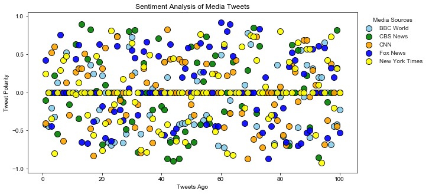
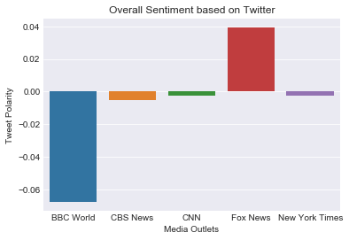

```python
# Dependencies
import tweepy
import numpy as np
import pandas as pd
import seaborn as sns
from datetime import datetime
import matplotlib.pyplot as plt

# Import and Initialize Sentiment Analyzer
from vaderSentiment.vaderSentiment import SentimentIntensityAnalyzer
analyzer = SentimentIntensityAnalyzer()

# Twitter API Keys
from config import (consumer_key, 
                    consumer_secret, 
                    access_token, 
                    access_token_secret)

# Setup Tweepy API Authentication
auth = tweepy.OAuthHandler(consumer_key, consumer_secret)
auth.set_access_token(access_token, access_token_secret)
api = tweepy.API(auth, parser=tweepy.parsers.JSONParser())
```


```python
# Target Accounts: BBC News, CBS News, CNN, Fox News, and The New York Times
target_users = ("@BBCWorld", "@CBSNews", "@CNN", "@FoxNews", "@nytimes")
news_orgs = ['BBC World', 'CBS News', 'CNN', 'Fox News', 'New York Times']
```


```python
# Initialize list of dataframes
df_list = []

# Loop through each target_user
for target_user in target_users:  
    counter = 1 
    sentiments = []
    oldest_tweet = None 
    
# Loop through 5 pages of 20 tweets to collect sentiment scores
    for x in range(5):
        public_tweets = api.user_timeline(target_user, max_id = oldest_tweet)

        # Analyzing sentiment scores
        for tweet in public_tweets:
            results = analyzer.polarity_scores(tweet["text"])
            compound = results["compound"]
            pos = results["pos"]
            neu = results["neu"]
            neg = results["neg"]
            tweets_ago = counter

            oldest_tweet = tweet['id'] - 1

            sentiments.append({"Date": tweet["created_at"], 
                               "Compound": compound,
                               "Positive": pos,
                               "Negative": neu,
                               "Neutral": neg,
                               "Tweets Ago": counter}) 
            counter += 1

# Create DataFrame and append each to df_list
    sentiments_pd = pd.DataFrame.from_dict(sentiments)
    df_list.append(sentiments_pd)
```


```python
# Add column with news org
x = 0
for i in news_orgs:
    df_list[x]['News Organization'] = i
    x += 1

# Use df_list to create total DataFrame
df_list_concat = [df_list[i] for i in range(len(df_list))]
df = pd.concat(df_list_concat)

df.to_csv('NewsMood.csv')
```


```python
col = ['skyblue', 'green', 'orange', 'blue', 'yellow']
f = plt.figure(figsize=(10,5))
ax = f.add_subplot(111)

sns.set_style('darkgrid')

for i in range(len(df_list)):
    ax.scatter(df_list[i]['Tweets Ago'], df_list[i]['Compound'],
               color = col[i],
               edgecolor='black',
               alpha= 0.9,
               s=100)

plt.title('Sentiment Analysis of Media Tweets')
plt.xlabel('Tweets Ago')
plt.ylabel('Tweet Polarity')
plt.yticks([-1, -0.5, 0, 0.5, 1])

plt.legend(labels = news_orgs,
          bbox_to_anchor=(1, 1),
          title='Media Sources',
          frameon=False)

plt.savefig('NewsMoodSentiments.png')
plt.show()
```





```python
means = df.groupby('News Organization')['Compound'].mean()
means
```


    News Organization
    BBC World        -0.067933
    CBS News         -0.005221
    CNN              -0.002507
    Fox News          0.039430
    New York Times   -0.002583
    Name: Compound, dtype: float64


```python
sns.barplot(x=news_orgs, y=means)
sns.set_style("darkgrid")

plt.xlabel('Media Outlets')
plt.ylabel('Tweet Polarity')
plt.title(f'Overall Sentiment based on Twitter')
plt.savefig('OverallSentiment.png')
```




